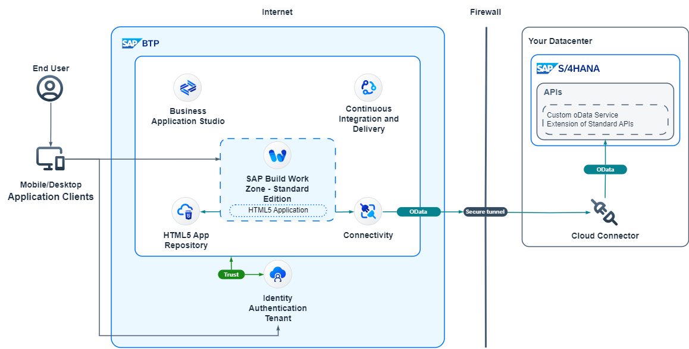

# Mission: Setup for SAP S/4HANA side-by-side UI Extensions on SAP Business Technology Platform

The main focus of this mission is to show the full end-to-end setup for a SAP S/4HANA on-premise extension on SAP BTP (Cloud Foundry) this includes the following steps:
* Setup SAP S/4HANA on-premise system
* Setup of SAP BTP account and development environment
* End-to-End connection setup with Principal Propagation (SSO)
* DevOps - using SAP Continuous Integration & Delivery and monitoring
* Integration of the HTML5 application in a central company site with SAP Workzone

We will create a simple custom UI application, show the usage of the HTML5 repository and the different options how to expose this application - as a stand-alone or with the SAP Build Work Zone, standard edition environment to establish a unified point of access to SAP (e.g. SAP S/4HANA), custom-built, and third party applications and extensions, both on the cloud and on premise. Note: SAP Launchpad service was recently renamed to SAP Build Work Zone, standard edition.

[Mission in SAP Discovery Center](https://discovery-center.cloud.sap/missiondetail/3239/3325)

## Discover

* [The Mission Story](./discover/MissionStory.md)
* [Learn the Basics of SAP BTP](./discover/BTP.md)
* [Learn about SAP S/4HANA](./discover/S4H.md)
* [Learn about SAP Connectivity Service](./discover/Connectivity.md)
* [Learn about HTML5 Applications](./discover/HTML5.md)
* [Learn about SAP Business Application Studio](./discover/BAS.md)
* [Learn about SAP Cloud Identity Services](./discover/IAS.md)
* [Learn about DevOps and SAP Continous Integration and Delivery](./discover/CICD.md)
* [Learn about SAP Work Zone](./discover/Launchpad.md)
* [Learn about Observability on SAP BTP](./discover/Observability.md)
* [Learn about ABAP Development Tools](./discover/adt.md)

These are the step-by-step guidelines for running the mission. It is divided in three workstreams:

## Landscape Setup

The setup of the landscape consists of preparing the API in the SAP S/4HANA on-premise system and exposing the backend oData service using SAP Cloud Connector. There are also step-by-step instructions to setup the trust between SAP Cloud Connector and SAP S/4HANA system.

* [Set up an SAP S/4HANA system from the SAP Cloud Appliance Library - optional](https://github.com/SAP-samples/cloud-extension-ecc-business-process/blob/mission/mission/cal-setup/CALS4H.md)
* [Set up the SAP S/4HANA on-premise System](./s4h-setup/README.md)
* [Set up SAP Cloud Connector & Trust to the SAP S/4HANA System](./cloud-connector/README.md)
* [Set up the SAP Business Technology Platform Account](./scp-setup/README.md)
* [End-to-End Connectivity Setup](./connectivity/README.md)
* [Set up SAP Identity and Authentication Service (optional)](./custom-idp/README.md)

## Implementation of a custom OData service

After the setup is done we can start to create UI API for the future application. Standard APIs provided by SAP cannot be used for this purpose.

* [Motivation](./rap-service/motivation.md)
* [Explore Business Object Projection](./rap-service/explore-projection.md)
* [Setup ABAP Development Tools](./rap-service/adt-setup.md)
* [Create the Data Definitions](./rap-service/create-data-definitions.md)
* [Create the Metadata Extension](./rap-service/create-metadata-extension.md)
* [Expose the OData Service](./rap-service/expose.md)
* [Test the Service](./rap-service/test.md)

## Implementation of a simple UI application

Once we have setup the landscape, we can now develop, test and run a simple UI application. We will show the steps to implement the simple UI application using the SAP BTP managed HTML5 repository. This is a kind of PoC to see if and how the whole landscape setup is working.

* [Develop a simple UI application](./create-application/develop/README.md)
* [Test the simple UI application](./create-application/test/README.md)
* [Build and deploy the application to your SAP BTP Cloud Foundry account](./create-application/buildDeploy/README.md)
* [Integrate the Continous Integration & Continous Delivery Service](./ci-cd-service/README.md)
* [Integrate the Application with SAP Build Work Zone, standard edition](./launchpad/README.md)
  

