# Creating a CI/CD Pipeline for your Cloud Application

## Introduction

In this section, we describe steps how to configure and run predefined continuous integration and delivery (CI/CD) pipelines that automatically test, build, and deploy your code changes to speed up your development and delivery cycles.

**Persona:** Cloud Administrator (SAP BTP) / Cloud Application Developer

**Abbreviation:** SAP Business Technology Platform = SAP BTP


## Step-by-Step


### Create Github Repository

This step describes how to create a Github repository in which you can store the source code of your project. You need to have a user in the public GitHub to execute the steps below.

1. Open your github home page.
2. Click on *New* in the **Repository** tab to create a new repository.

   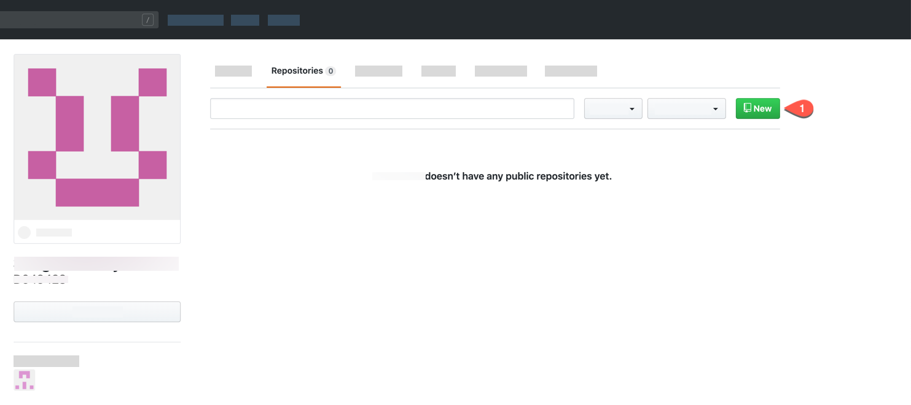
   
3. Enter the name of the repository. For example, **extendUI**. Do not check the checkbox **Intialize this repository with a README**.
4. Click on create repository.

    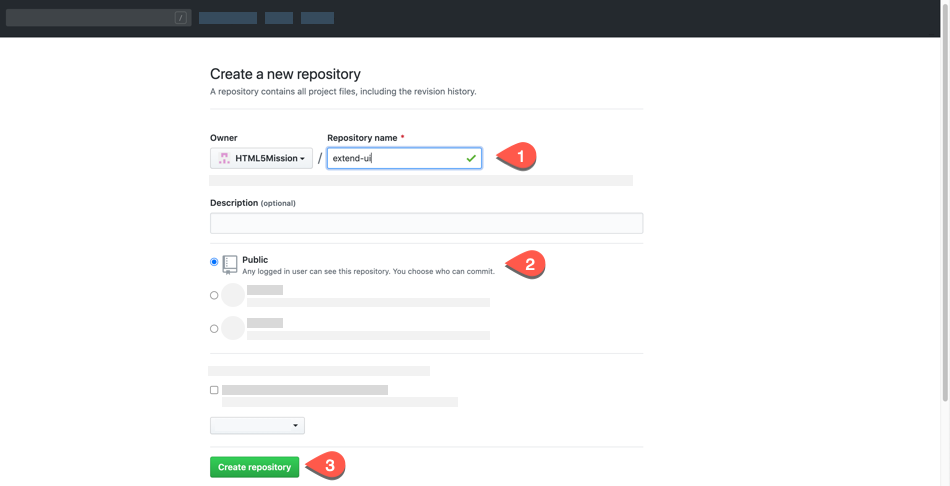

5. Copy the github url of the newly created Git repository.

   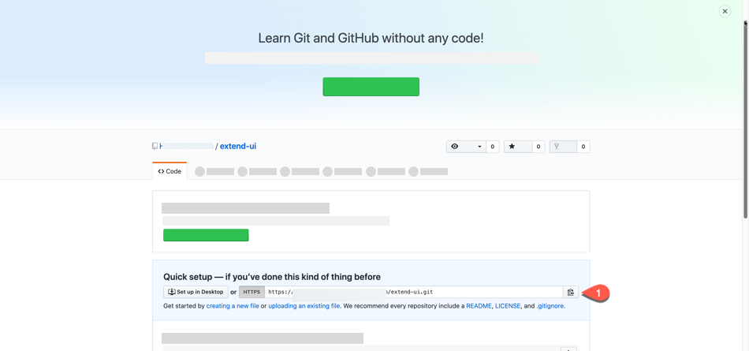
   

   
### Generating OAuth Token

1. As the public Git hub announced deprecation of Basic Authentication, we have described steps to login with the Access tokens to the Git.
2. Refer to the public GitHub link and create a [Personal Access Token](https://docs.github.com/en/github/authenticating-to-github/creating-a-personal-access-token).
3. You can use these Access tokens when you want to use Git commands instead of giving Git password.

### Add Git repository to HTML5 project

1. Login to your SAP Business Technology Platform (BTP) account. 
2. Let us open the service **Business Application Studio** by following the steps described in [Open SAP Business Application Studio](../develop/README.md#open-sap-business-application-studio).
3. You would be prompted with a login screen of the default/custom Identity Provider depending on how you have configured.
4. Login to the Application using your default/custom Identity Provider credentials.
5. If your workspace is stopped, click **Start** to start your dev space and click the name of your dev space to open your workspace.
6. Open a new terminal and navigate to project root folder.

   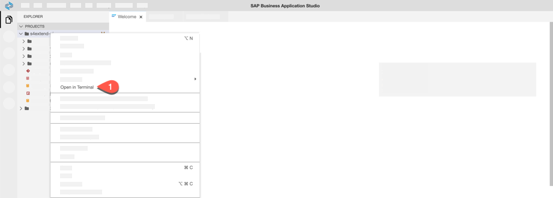 
   
7. Enter your email address and User name to be used by Git. You can use the email address which you have used to register the Git account.
   ```
   git config --global user.email "you@example.com"
   git config --global user.name "Your Name"
   ```
8. Now we are initializing a Git repository which can be used to convert an existing, unversioned project to a Git repository or initialize a new, empty repository. To use  other Git commands, you need an initialized repository, so this is usually the first command you**ll run in a new project. Let us run the following commands:

	```
    git init
    git add .
    git commit -m "Push project content to github"
    ```
   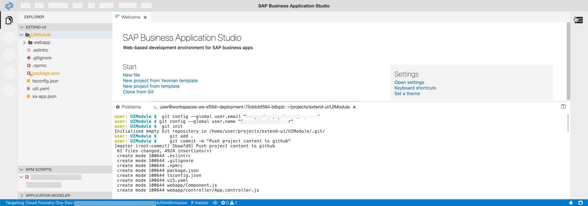
    
9. Now take the copied GitHub Repository URL which you created and copied in step 5 of **Creating GitHub Repository** and add this URL pointing as the remote repository.

   ```
   git remote add origin <copied Git repository url.git>
   ```
    
10. Let us push the commit with project contents to the default branch of your GitHub Repository. Please check in your GitHub repository if your default branch is master or main.  
    
   ```
   git push -u origin main
   ```
    
11. When prompted, enter your Git Username and Password (or Token).
    
    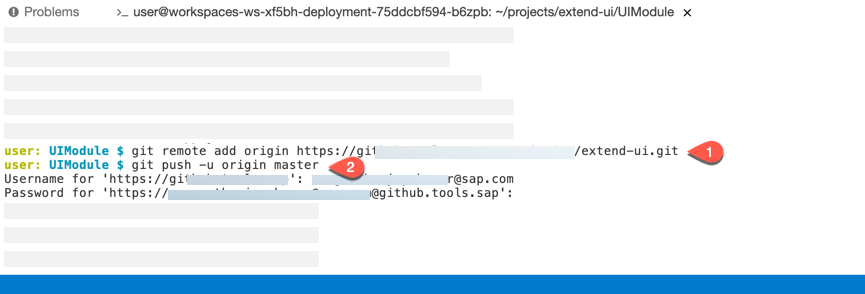
  
### Continuous Integration and Delivery pipeline setup

1. In your subaccount in the SAP BTP cockpit.
2. Click **Services** and choose **Instances and Subscriptions**. 
3. Select the tab **Subscriptions**, look for **Continuous Integration and Delivery**, click the three dots **...** to open the relevant **Actions**. Click **Go to Application** to open **Continuous Integration and Delivery** service.

   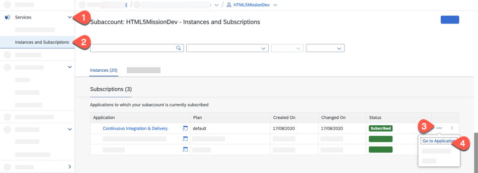

4. Login to the CI/CD application using the company identity provider account credentials. In the next steps, we will configure credentials and the repository for connecting SAP Continuous Integration and Delivery to other services like GitHub and cloud accounts.
 
5. Let us create Credentials to connect to GitHub to clone the sources. This step is only needed if your GitHub repository is private else you can skip this step.
  - Choose the **Credentials** tab and then choose **+**. For the user name, enter your Github user name. 
  - For **Type**, select **Basic Authentication**.
  - In the **Username** field enter your GitHub user.
  - For **Password**, use the personal access token which you created in your GitHub account in the previous section. 

     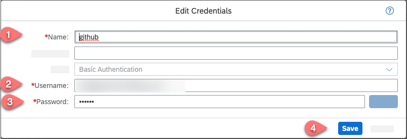

6. In the Credentials tab, choose **+** (Create Credentials) to configure credentials of a SAP BTP user, who has the appropriate permissions. The user must have the Space Developer role and also be a member of the specified Cloud Foundry organization and space. 
We recommend using a technical user. However, you can use also use your cloud credentials. 
  - Enter a name for the cloud credentials, ex: cloud-credentials
  - Type: Choose **Basic Authentication**
  - Username: Enter your **SAP BTP email id**
  - Password: Enter your **SAP BTP user password**

   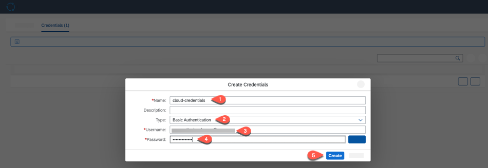
    
7. Select the **Repositories** tab and then choose the **+** icon to create a new repository.
8. In the **Add Repository** screen enter the following values:
   * In the **Name** field set the name for the repository for example: cloud-extension-html5-mission
   * In the **Clone URL** set the clone URL of your GitHub repository
   * In the **Credentials** field choose the credentials for your GitHub repository which you created in step 6  - it is necessary for private GitHub repositories.
   * In the **Type** field choose GitHub   
   * In the **Webhook Credential** field choose **\<GENERATE\>**
   * Keep the **State** field on
   * **Add** the repository  
   
   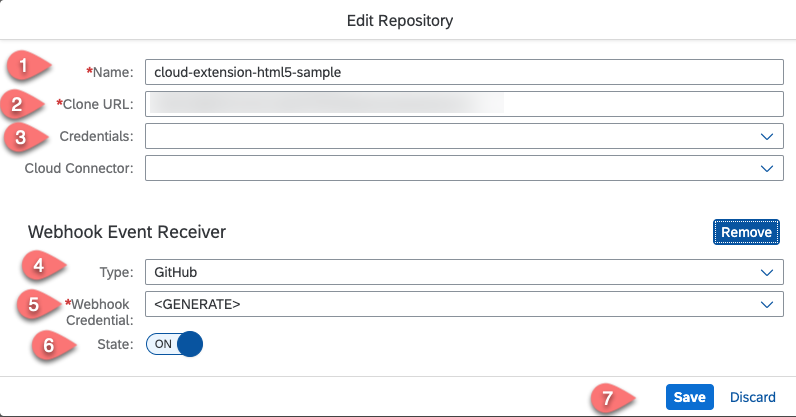

9. Select the created repository. On the right top choose the ... and then choose **Webhook Data**.

   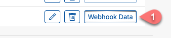


10. The **Webhook Creation** pop-up appears. It provides you with the data you need to define a webhook in GitHub. Copy the **Payload URL** and the **Secret** into a text editor of your choice.
   
     
   

11. Before creating the CI/CD Job, let us copy the Cloud Foundry API endpoint, Org and Space which is needed for this next step. Choose the Overview page of your SAP BTP subaccount and copy the **API Endpoint** and **Org Name** into a text editor of your choice.  

    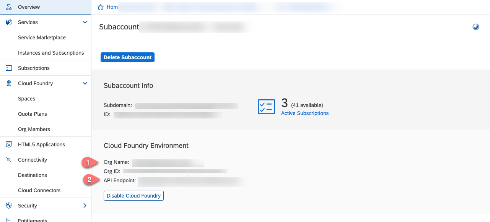
    
12. Choose **Spaces** and copy the space name to a text editor of your choice. 

    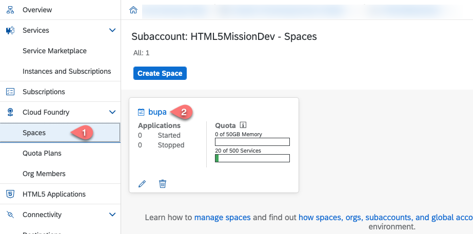

13. Go back to the SAP Continous Integration and Delivery service. Choose the **Jobs** tab and **+** icon to create a new job.

14. In the **Create Job** screen, enter the following inputs :
    
    - In the **Job Name** field enter a name for example, **cloud-extension-html5-mission**
    - In the **Repository** field choose the repository you have created in step 8. 
    - In the **Branch** field enter the branch of your GitHub repository for example **master**
    - As **Pipeline** choose **SAP Fiori in the Cloud Foundry environment** 
    - In the **Version** field choose the latest or leave the default
    - In the **Build Retention** fields keep the default values
    
    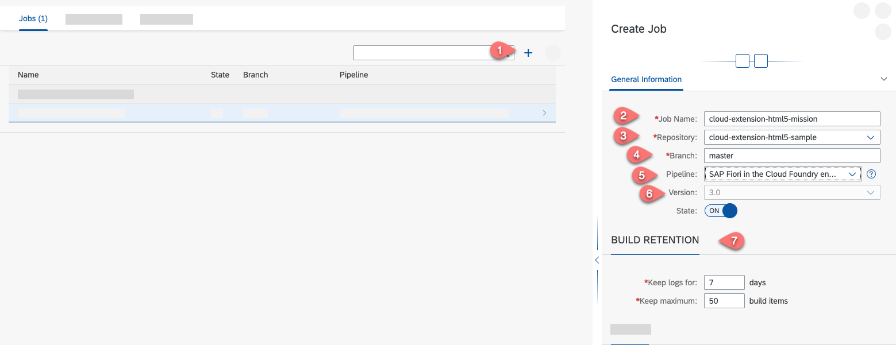
    
15. In the **Stages** section do the following:
   - In the **Configuration Mode** field choose **Job Editor**
   - Choose **ON** for the **State** field in the **Build** section
   - In the Malware Scan section choose **ON** for the **State** field. This will force a check for malicious software in your build package. 
   - Also in the **Release** section set the **Deploy to Cloud Foundry Production Space** field to **ON**.
   - In the **API Entpoint** and **Org Name** fields set the values from step 11.
   - In the **Space** field set the value form step 12.
   - In the **Credential** field select the credentials for your SAP BTP account that you have created in step 6.
   - Choose **Save** 

   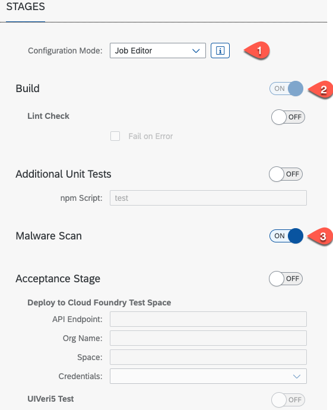
   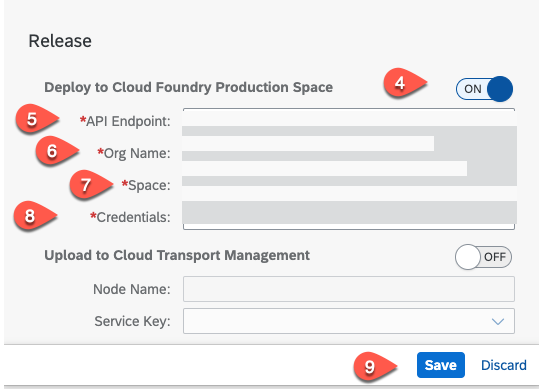
    
16. Open your GitHub repository and choose **Settings** --> **Webhooks** --> **Add webhook**.

    
    
17. For the **Payload URL** and **Secret**, copy and paste the payload URL and secret from step 10.

    
    
18. For **Content Type**, select **application/json** and configure the job to be triggered for every **Push** event and choose **Add Webhook**. Now, any new push request to this repository triggers the CI/CD pipeline you have created.

19. To trigger the pipeline manually, select the CI/CD job you have created and choose the **Trigger build** icon as shown below. 

    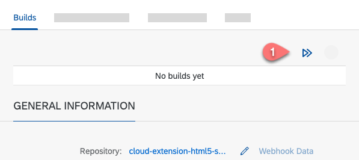
    
20. You can see the successful log results of **Build** and **Deploy**. To view the full log file, click on the respective tile.
	
    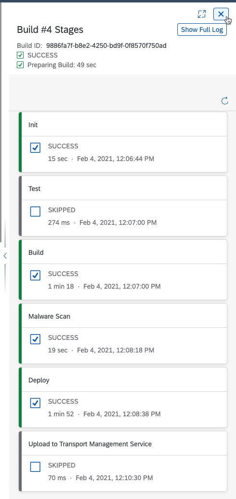   

      
### Test automatic triggering of CI/CD job

You**ve configured a webhook between GitHub and the SAP Continuous Integration and Delivery service . Now, whenever you push changes to your GitHub repository, a webhook push event is sent to the service and triggers a build of the connected job.

1. To test automatic triggering of the build job, let us change a file and push the changes to the Git repository.
2. Switch to the **Business Application Studio** and open the workspace in which the project is created. 
3. Change the index.html file by editing the title. 

   ```
   <h1> Updated Business Partner </h1>
   ```
   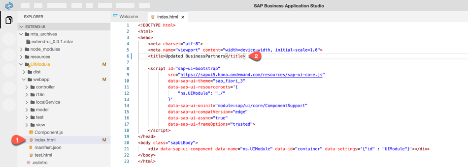 
   
4. Switch to the **Source Control: Git** tab and add the **index.html** file from the unstaged changes to the staged changes by clicking the **+**, Enter a commit message for example: "Test Commit". Click the tick symbol as shown in the screenshot to commit the changes.

   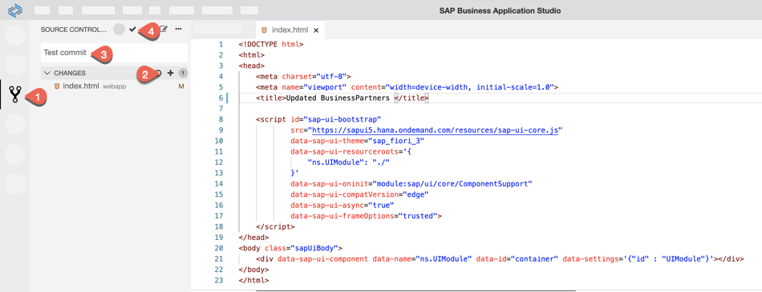
   
5. Let us push the commit by switching to the **Terminal** window like before. Enter the following command and push to your default branch (master or main), then enter your GitHub user name and GitHub access token. 

   ```
   git push -u origin main
   ```

   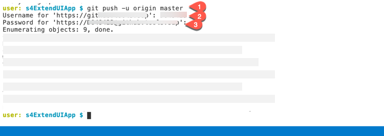
   
6. This Git push to the repository triggers the SAP Continous Integration and Delivery job. Switch to the browser window **Continous Integration & Delivery** to check the automatically triggered job.
  
   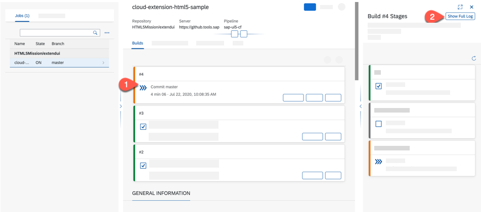

### Result
You have successfully configured and added a continous integration / continous delivery pipeline to your cloud application.

### Related Links
- [Git Basic Authentication](https://developer.github.com/enterprise/2.20/v3/auth/#basic-authentication)
- [Deprecating password authentication](https://developer.github.com/changes/2020-02-14-deprecating-password-auth/)
- [Git - Initializing a repository](https://www.atlassian.com/git/tutorials/setting-up-a-repository/git-init)
- [Assigning Roles and Permissions for SAP Continous Integration and Delivery](https://help.sap.com/viewer/99c72101f7ee40d0b2deb4df72ba1ad3/Cloud/en-US/c679ebdbe76142bd9fb1071e5e53511d.html)

