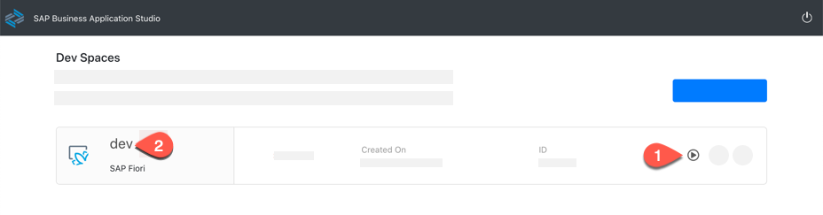
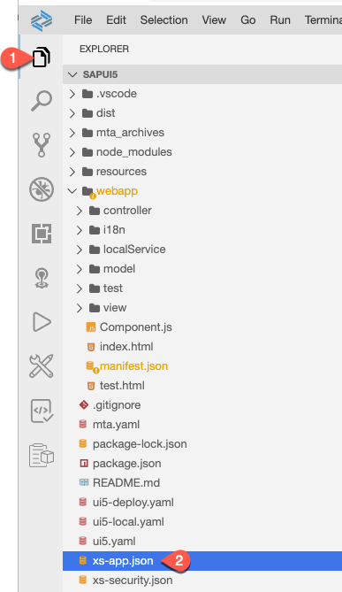
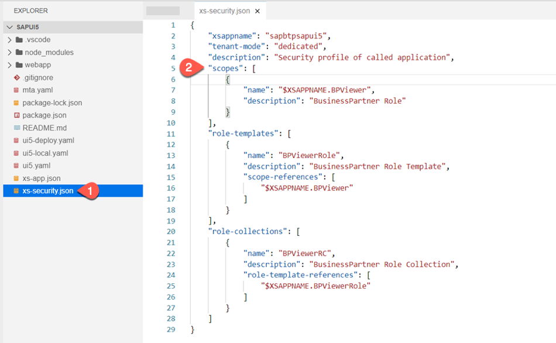
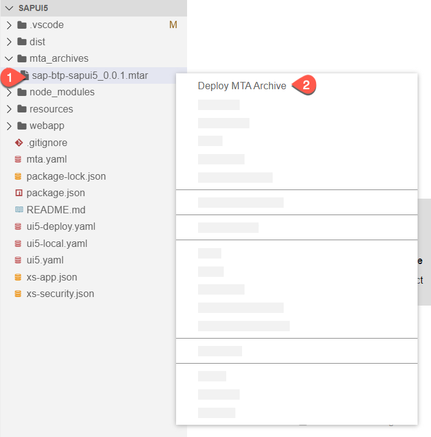
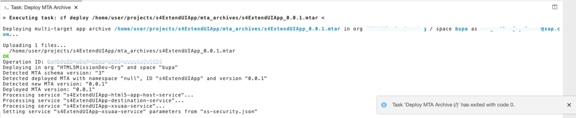
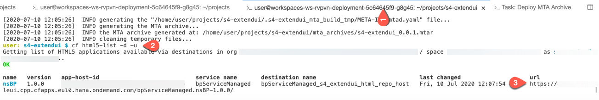
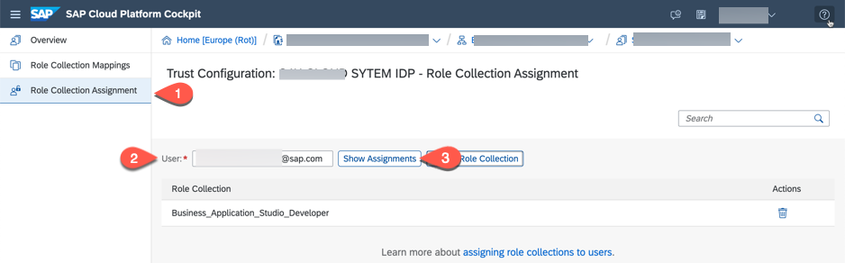
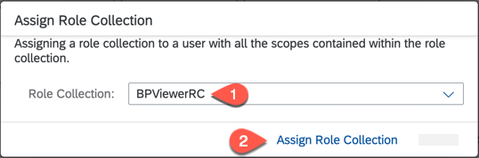
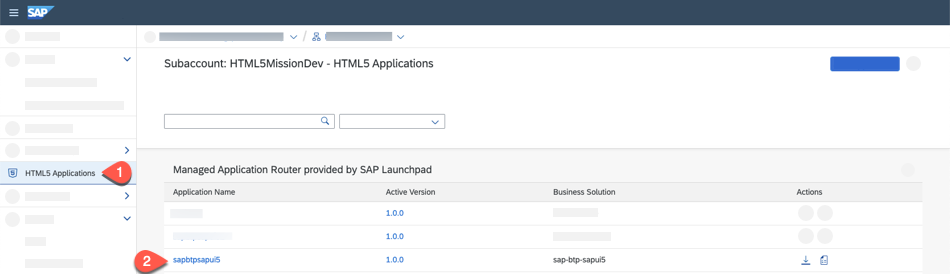
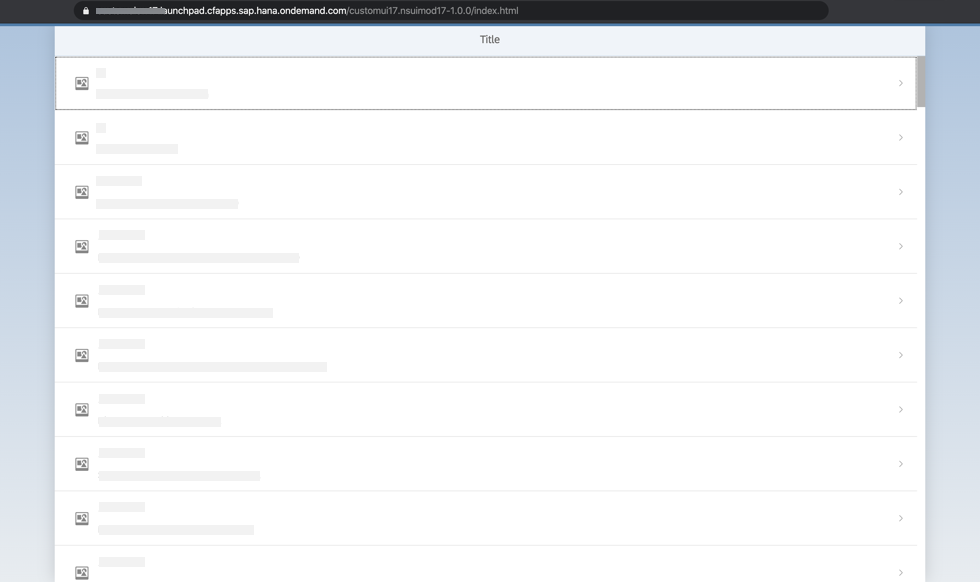

# Building and Deploying a Cloud Application

## Introduction

In this section, we would describe steps to build and deploy your cloud application which was already created using SAP Business Application Studio.

**Persona:** UX Developer

**Abbreviation:** SAP Business Technology Platform = SAP BTP


## Step-by-Step

### Open Business Application Studio and login to your SAP BTP Cloud Foundry subaccount

1. Login to your SAP BTP account. 
2. Goto your subaccount and click on Subscriptions. 
3. Search for **SAP Business Application Studio** and click on **Go to Application**. 

   
   
4. You would be prompted with a login screen of the custom Identity Provider what you have configured.
5. Login to the Application using your custom Identity Provider credentials.
6. If your workspace is stopped, 'Start' it and then Open your previously created 'dev' workspace.

   
   
7. Check if you are logged in to your SAP BTP subaccount from **SAP Business Application Studio**.
8. Login to ypur Cloud Foundry account: In the tabs, click on View-> Select **Find Command**.
9. Search for **CF Login**.
10. Select for **CF: Login on to Cloud Foundry**.

     
    
11. Enter CF API endpoint or take the default suggested API endpoint. You can find the API endpoint of your region by switching into your SAP BTP subaccount browser window and copy the API Endpoint. Also write down the 'Org Name' into a text editor of your choice which is needed for the next step.  

    
    
12. Choose 'Spaces' and write down the space name to a text editor of your choice. 

    
     
13. Enter **Email** and **Password** when prompted.
14. Select your Cloud Foundry **Org** which you have noted down in step 11. 
15. Select the space name which you have noted down in step 12. Once you have selected the Org and Space, you would login to Cloud Foundry in SAP Business Application Studio.


### Add scopes and role templates to your HTML5 application
 
1. Click on **Explorer** and open the xs-app.json file.

   
   
2. Add the scope in the xs-app.json file. Go to the xs-app.json add the line in the **routes** section as shown below: **scope**: **$XSAPPNAME.BPViewer**. Add a **,** to the previous line. The block looks like below after adding the line.

   ```
   {
     "source": "^(.*)$",
     "target": "$1",
     "service": "html5-apps-repo-rt",
     "authenticationType": "xsuaa",
     "scope": "$XSAPPNAME.BPViewer"
    }
    ```
 
3. Open xs-security.json and replace the code as shown below inside scope, role templates and role collections.

    ```
    "scopes": [
     {
     "name": "$XSAPPNAME.BPViewer",
     "description": "BusinessPartner Role"
     }
    ],
    "role-templates": [
     {
     "name": "BPViewerRole",
     "description": "BusinessPartner Role Template",
     "scope-references": [
         "$XSAPPNAME.BPViewer"
     ]
     }
    ],
    "role-collections": [
         {
         "name": "BPViewerRC",
         "description": "BusinessPartner Role Collection",
         "role-template-references": [
         "$XSAPPNAME.BPViewerRole"
             ]
         }
     ]
    
    ```
 
4. After replacing, the xs-security.json file looks like below:

    
    
### Building your HTML5 application
   
1. To build our application, there are many ways to do it. Either right-click on the mta.yaml file and choose "Build MTA" or build via commandline. We show you one of the options here. For details, check the official [help page for Building and Deploying Multitarget Applications](https://help.sap.com/viewer/9d1db9835307451daa8c930fbd9ab264/Cloud/en-US/97ef204c568c4496917139cee61224a6.html). 
2. Click on Terminal-> New Terminal and navigate to the project root folder, e.g : cd s4-extendui/
3. Run command 'mbt build'.

    
    
    
### Deploy the HTML5 Application to your SAP BTP space

1. If you want to deploy to a SAP BTP space, make sure you are logged in to your SAP BTP subaccount like shown in step above. 
2. Now let us deploy the built archive. Expand the folder **mta_archives** and right-click on the built file **extend-ui-1.0.0.mtar** and select **Deploy MTA Archive**.

    
    
3. You can see the progress of the deployment in a progress task window **Task: Deploy MTA Archive**.
   
   
     
4. In order to see the URL of the deployed HTML5 application via command line, switch to the Terminal tab which you opened in previous build step 10 and run the commnd cf html5-list -d -u to see the url of the deployed application.
   
   
   
5. Copy the URL of the HTML5 application.
6. To see the list of other Cloud Foundry commands, see the [Cloud Foundry HTML5 Apps Client Help](https://github.com/SAP/cf-html5-apps-repo-cli-plugin)

### Assigning role collection to the user

In the previous step, we have added a Role Collection **BPViewerRC** in **xs-security.json** file. So only users who are assigned to this role can view the application. 


1. In the SAP BTP subaccount Overview page, click on Security> Trust Configuration.
2. Click on your company Identity Provider which has the users who will login to the application. 
3. Click on **Role Collection Assignment** and Enter your email id and click on **Show Assignments**. This User/Email has to be already configured to your identity provider.

   
   
4. Click on **Assign Role Collection**.
5. Select **BPViewerRC** and click on **Assign Role Collection**. (Same as in previous step).

   
   
### Accessing the deployed application

   
1. To open your deployed HTML5 application, switch to the SAP BTP subaccount page and choose **HTML5 Applications**. Click on the application link to open the application. You have also noted this application link in the  earlier step in SAP Business Application Studio with command **cf html5-list -d -u**.
  
   
     
2. Once you open the app in a new browser window, login to the application using your company Identity Provider.
3. Now your HTML5 application fetches the data from the configured backend system.

   

### Result
You have successfully now built and deployed your HTML5 application to SAP BTP which fetches you business partner data from the configured backend system. 

### Related Links

[Cloud Foundry HTML5 Apps Client Help](https://github.com/SAP/cf-html5-apps-repo-cli-plugin)