# Developing a Cloud Application

## Introduction

In this section, we would describe steps to develop a cloud application using SAP Business Application Studio.

**Persona:** UX Developer

**Abbreviation:** SAP Business Technology Platform = SAP BTP

## Step-by-Step

### Open SAP Business Application Studio 

1. Login to your SAP BTP account cockpit. 
2. Goto your Subaccount and click **Services** and choose **Instances and Subscriptions**. 
3. Select the tab **Subscriptions**, in the line with **SAP Business Application Studio**, click the three dots **...** to open the relevant **Actions**. Click **Go to Application** to open **SAP Business Application Studio**.

   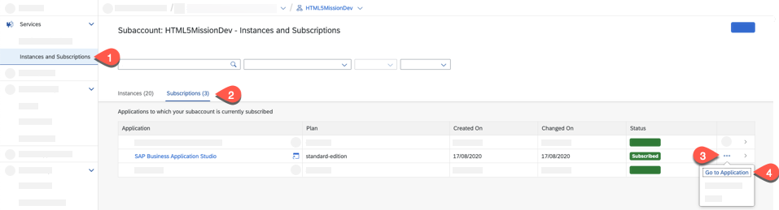
   
4. You would be prompted with a login screen of either default Identity Provider or custom Identity Provider depending on what you have configured.
5. Login to the Application using your default/custom Identity Provider credentials.

### Create a Dev workspace

1. Click on **Create Dev Space**.
2. Enter the name of the space and Choose **SAP Fiori** and click **Create Dev Space**.

   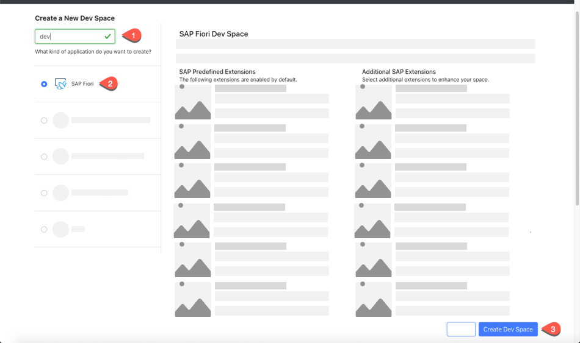
  
3. Once the devspace is created, open the dev space which you created now.

### Login to Cloud Foundry in SAP Business Application Studio 

1. You have opened **SAP Business Application Studio** and created and opened a Dev workspace.
2. In the next step, we will login to Cloud Foundry in **SAP Business Application Studio**, so let us copy the needed parameters in a text editor of your choice. 
3. Switch to the SAP BTP tab and click on **Overview** of the subaccount. Copy the **API Endpoint** and **Org Name** into a text editor of your choice. 

    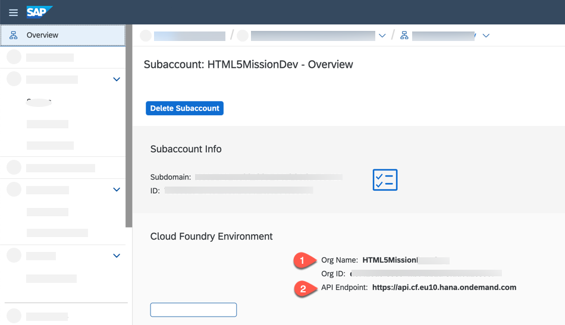

4. Choose **Spaces** and write down the space name as well to a text editor of your choice. 

    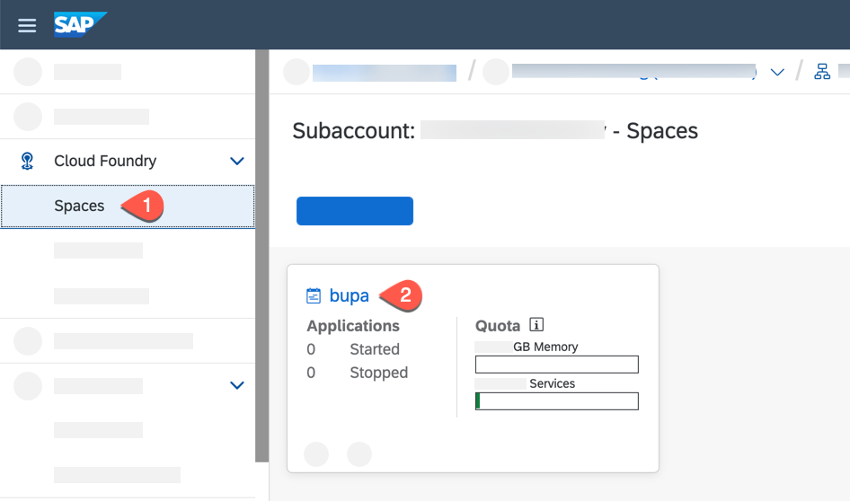

5. Switch to the tab where you have opened **SAP Business Application Studio**. In the tabs, click on View-> Select **Find Command**.
6. Search for **CF Login** and select **CF: Login on to Cloud Foundry**.

    
    
7. Enter CF API endpoint which you copied in step 3 or take the default suggested API endpoint.     
8. Enter your SAP BTP account **Email** and **Password** when prompted.
9. Select your Cloud Foundry **Org** which you have noted down in step 3. 
10. Select the space name which you have noted down in step 4. Once you have selected the Org and Space, you would login to Cloud Foundry in SAP Business Application Studio.
11. Now we have successfully created a workspace and pointed to our desired SAP BTP **Org** and **Space**.

### Develop the application from project template

1. Click on **Start from template** in the Welcome page to create the project. Alternatively, Go to View -> Find Command and search for **Create Project**. Select the command **SAP Application Studio: Create project from Template**

   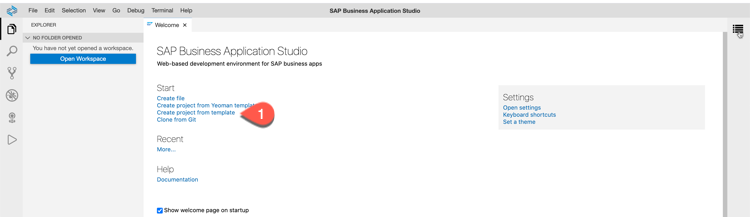
    
2. In the New Project Wizard, Select **SAP Fiori Freestyle Project (Deprecated)**. Click **Start**

   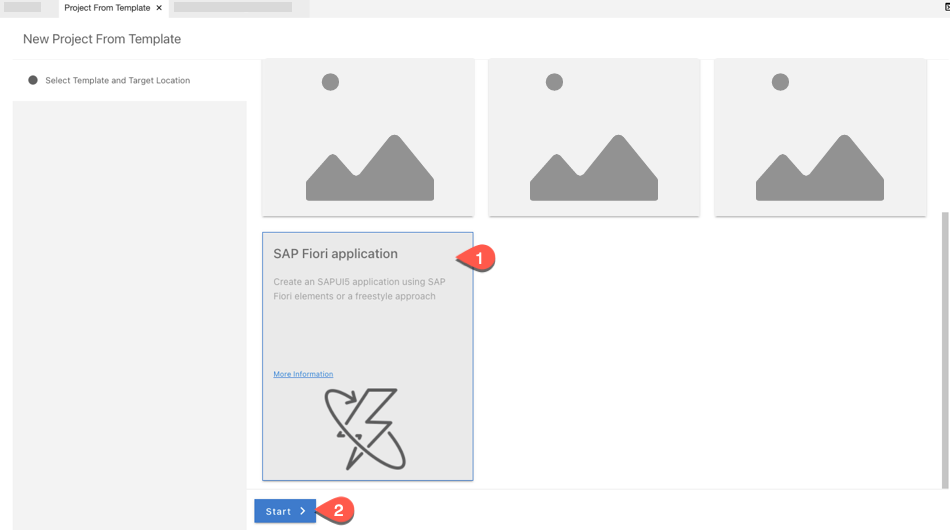

3. Select Target Running Environment as **Cloud Foundry**.
4. Select Template as **SAP Fiori Master Detail Application**. Click **Next**.

   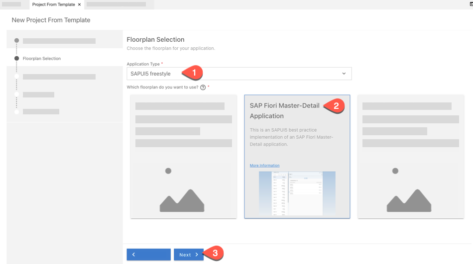
   
5. Enter Project Name as s4-extendui. Click **Next**.
    
   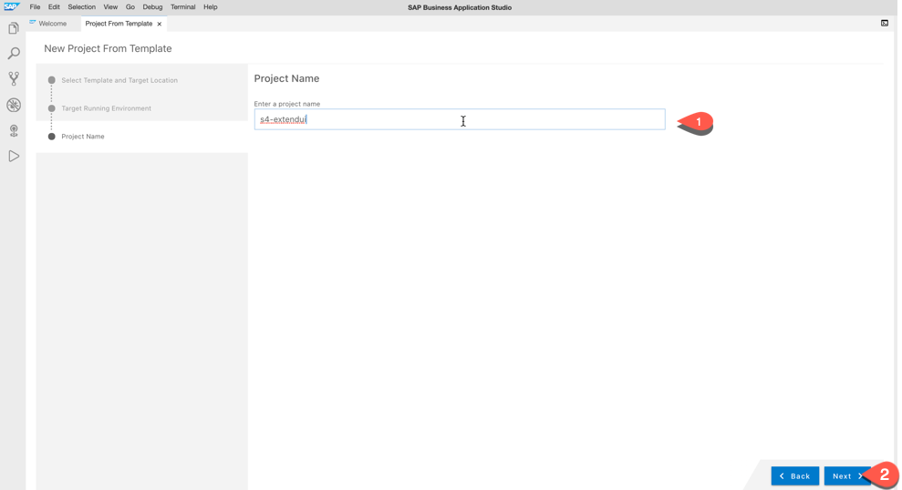

6. Choose **Managed Approuter** as HTML5 Application runtime.
7. Enter **bpServiceManaged** as the unique name for the business solution of your project. Click **Next**.

    
    
8. Enter **BP** as html5 module. Click **Next**. 

    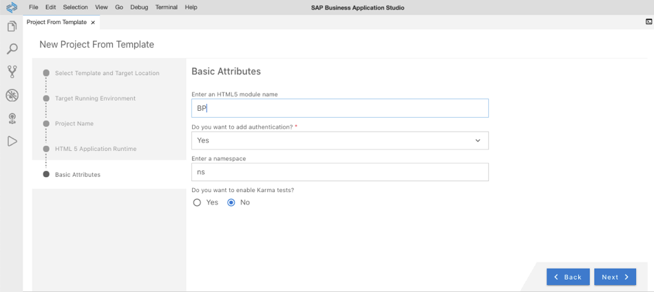
9. Enter Title **BusinessPartners**.
10. Select Standalone App (Optimized for individual development). Click **Next**.

    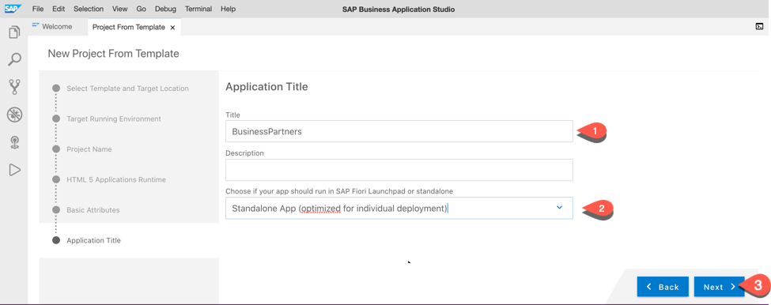
    
11. Select the system as **My SAP Systems**
12. For the field **Select source** select the earlier created destination pointing to your SAP backend system, which we named **bupa**. Click **Next**.

    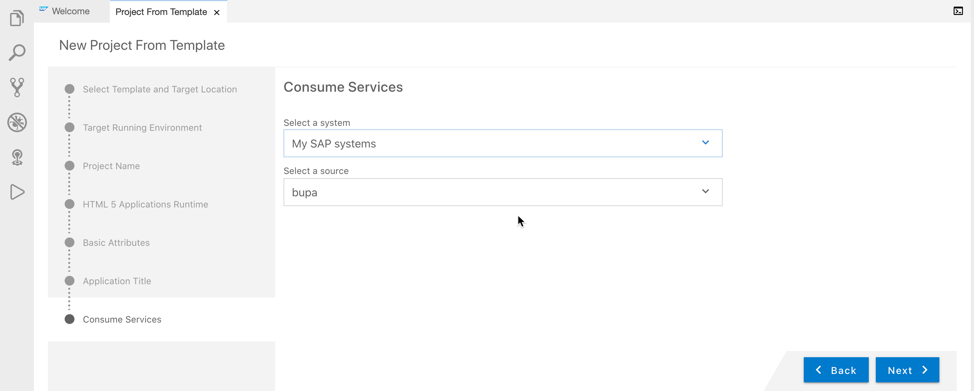
    
13. For the different fields of **Object Collection** :
     - Select drop-down Object Collection to **A_BusinessPartner**.
     - Select drop-down Object Collection ID to **BusinessPartner**.
     - Select drop-down Object Title to **BusinessPartnerFullName**.
     - Select drop-down Object Numeric Attribute to **Language**.
     - Select drop-down Object Unit of Measure to **BusinessPartnerCategory**.
     - Select drop-Down Line Item Collection to **to_BusinessPartnerAddress**.
     - Select drop-down Line Item Collection ID to **AddressID**.
     - Select drop-down Line Item Title to **CityName**.
     - Select drop-down Line Item Numeric Attribute to **CompanyPostalCode**.
     - Select drop-down Line Item Unit of Measure to **Country**.
     - Click **Next** and **Finish** to finish the project creation.

    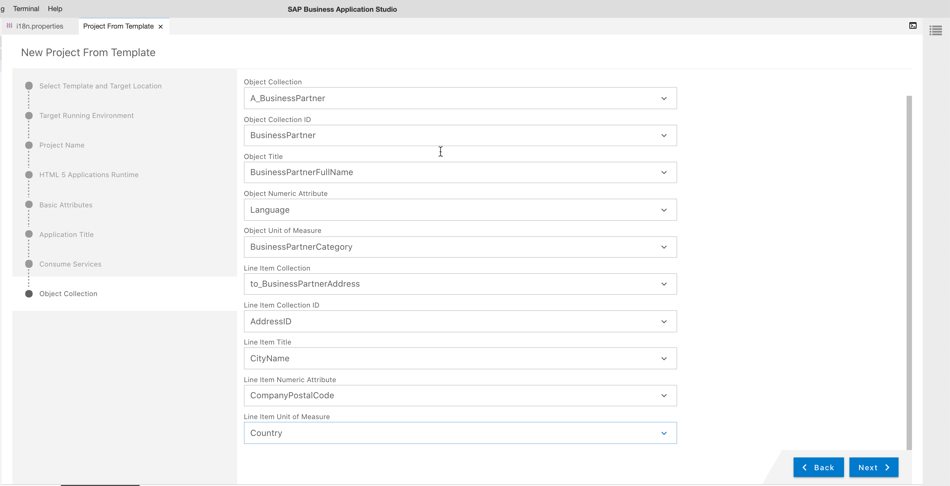
    
14. Once the project is created, Click on the button **Open in New Workspace** in the popup.

    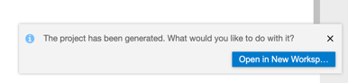
    
### Optional Step: Adding Internationalization to your project

1. If you want your generated project to have meaningful titles and column names, you can change the default i18n file to any language file you want.
2. In the opened workspace with your project, navigate to project folder **webapp**, then to folder **i18n** and open the file i18n.properties.
3. As a sample content, we have provided you a sample i18n.properties in [Sample i18n](./images/i18n.properties).
4. Replace the contents of the i18n file with our sample content.
5. You will see the customized column headers once we test the application in the next step. 

### Result
You have now configured a development workspace and created a HTML5 Application successfully.
