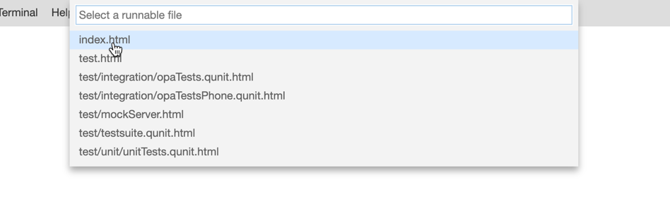
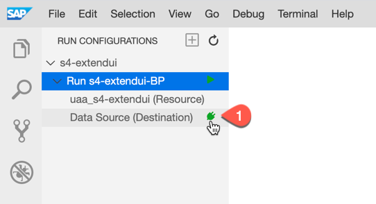
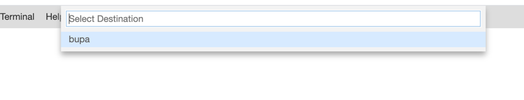
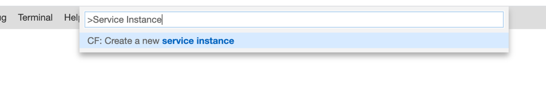
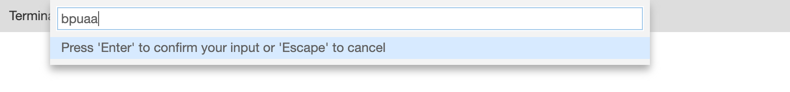
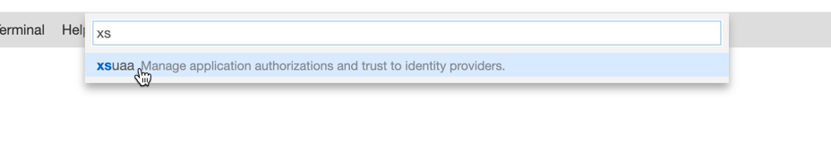
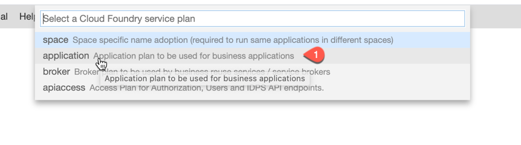
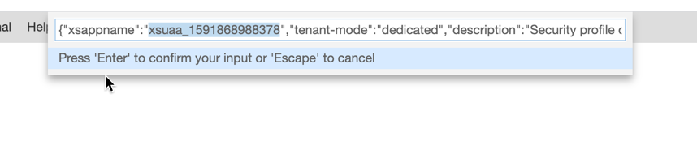
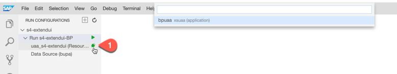
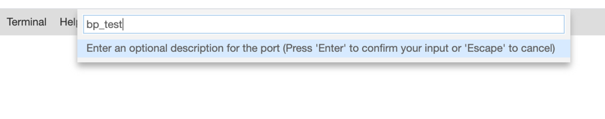

# Testing your Cloud Application

## Introduction

In this section, we would describe steps to test the cloud application which was already created using SAP Business Application Studio.

**Persona:** UX Developer

**Abbreviation:** SAP Business Technology Platform = SAP BTP

## Step-by-Step

### Open Business Application Studio and login to Cloud Foundry

1. Let us open the service **Business Application Studio** by following the steps described in [Open SAP Business Application Studio](../develop/README.md#open-sap-business-application-studio).
2. If your workspace is stopped, click **Start** to start your dev space and click the name of your dev space to open your workspace.

   

3. Login to Cloud Foundry following the steps described in [Login to CF](../develop/README.md#login-to-cloud-foundry-in-sap-business-application-studio).
   

### Test the HTML5 application
   
1. Now let us run and preview the HTML5 application. Click on **Run configuration** icon from left pane and click on **+** to add a new Run configuration.

   
   
2. Choose the application that was created.

   

3. Choose Runnable File: index.html.

   
   
4. Choose UI5 version : latest

    
    
5. Enter a name or leave the default to finish creating a Run configuration.

    
6. Expand the created Run Configuration. Now we need to map a destination for Data source and a XSUAA instance to see the preview application with data.
7. Click on Datasource (Destination) - Click on the green icon next to it.

    
    
8. Choose the Destination which was created in the SAP BTP.

     
     
9. Go to View > Find Command.
10. Search for **Service Instance** and choose **CF: Create new Service Instance**

    
    
11. Enter name : bpuaa

    
    
12. Choose service : xsuaa

    
    
13. Choose plan: application

    
14. Enter a custom xsappname or use the default. Now the XSUAA service instance is created.

    
15. Click on green icon near uaa in the Run configuration and select the created XSUAA instance **bpuaa** in Step 16.

    
    
16. Click on the play icon to run and preview the test application.

    
   
17. Click on **Expose and Open** in the popup that appears.

    
   
18. Give optional name and press **Enter**.

    
   
19. In a new browser window, the Preview Mode of the application is opened. The preview application shows the Business Partners which are fetched from the backend system configured in the SCP Destination.

### Result
Now you have how to test the simple UI application in *SAP Business Application Studio* and also preview the data from your SAP backend system.

   