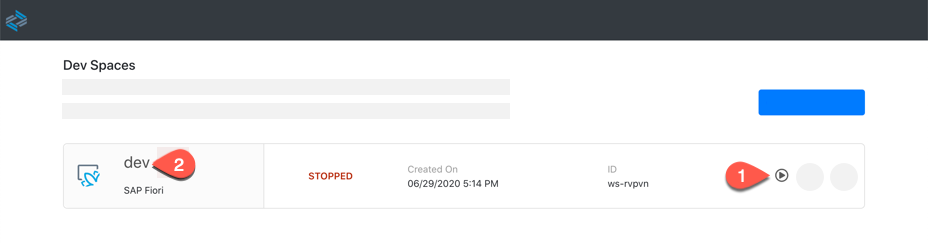
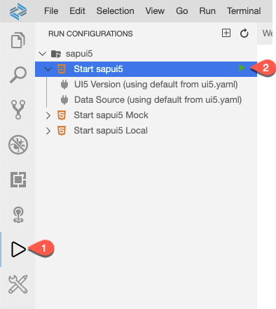
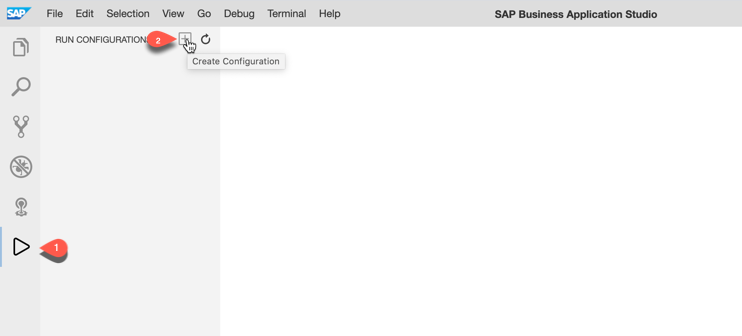
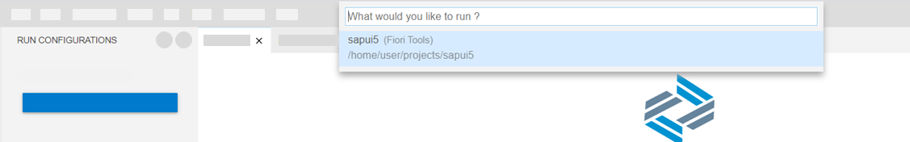
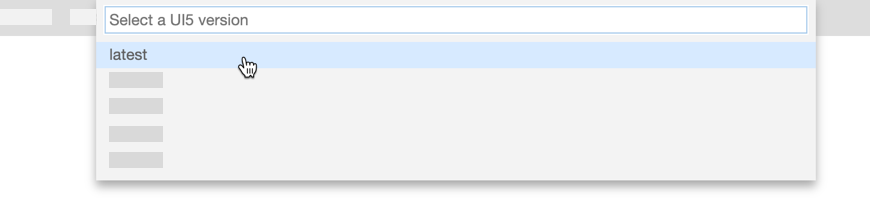
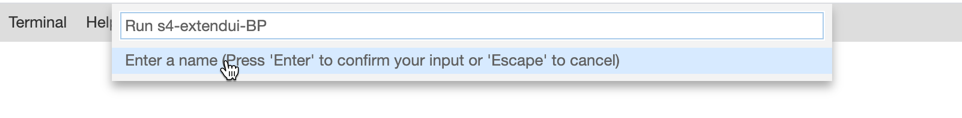
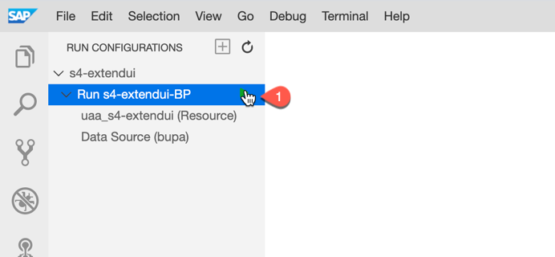
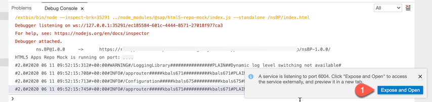
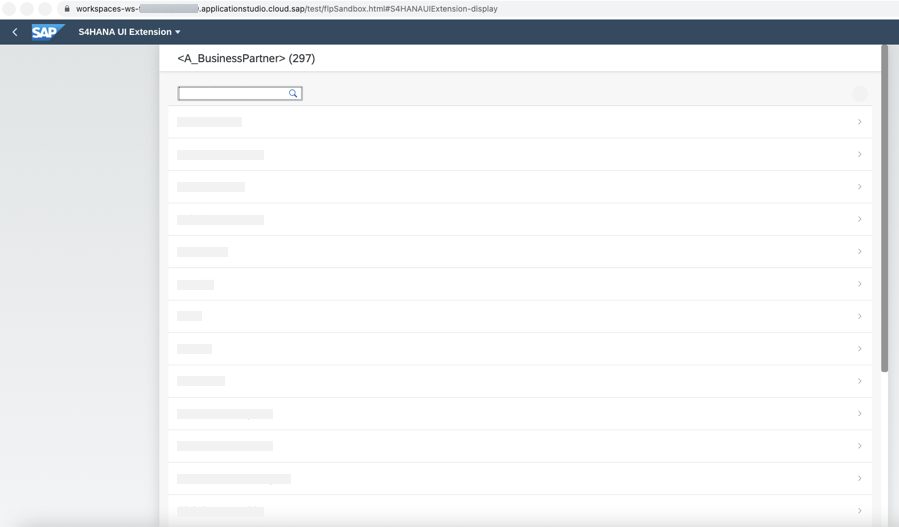

# Testing your Cloud Application

## Introduction

In this section, we would describe steps to test the cloud application which was already created using SAP Business Application Studio.

**Persona:** UX Developer

**Abbreviation:** SAP Business Technology Platform = SAP BTP

## Step-by-Step

### Open Business Application Studio and login to Cloud Foundry

1. Let us open the service **Business Application Studio** by following the steps described in [Open SAP Business Application Studio](../develop/README.md#open-sap-business-application-studio).
2. If your workspace is stopped, click **Start** to start your dev space and click the name of your dev space to open your workspace.

   

3. Login to Cloud Foundry following the steps described in [Login to CF](../develop/README.md#login-to-cloud-foundry-in-sap-business-application-studio).
   

### Test the HTML5 application
   
1. Now let us run and preview the HTML5 application. Click on **Run configuration** icon from left pane and check if you have pre-created test configuration by the project creation wizard.
2. If yes, then click the green play icon near **Start sapui5** to open the the preview application. You can then skip the following steps and directly see the preview application as shown in step 9.

   

3. If you do not have a pre-created **Run Configuration**, click on **+** to add a new Run configuration.

   
   
4. Choose the application that was created.

   

   
5. Choose UI5 version : latest

    
    
6. Choose **Connect to the SAP System** and then choosing the destination created, in our case, select **bupa**.

    
   
    
7. Once the test configuration is created, Click on the play icon to run and preview the test application.

    
   
8. Click **Open** in the popup that appears.

    
   
10. In a new browser window, the Preview Mode of the application is opened. The preview application shows the Business Partners which are fetched from the backend system configured in the SCP Destination.

    

### Result
Now you have how to test the simple UI application in *SAP Business Application Studio* and also preview the data from your SAP backend system.

   
