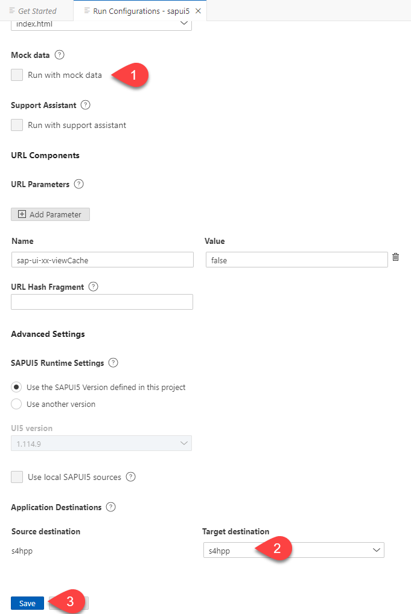

# Test Your HTML5 Cloud Application

## Introduction

In this section, we would describe steps to test the cloud application which was already created using SAP Business Application Studio.

**Persona:** UX Developer

## Step-by-Step

### Open SAP Business Application Studio and Log In to Cloud Foundry

1. Let us open the service **Business Application Studio** by following the steps described in [Open SAP Business Application Studio](../develop/README.md#open-sap-business-application-studio).
2. If your workspace is stopped, choose **Start** to start your dev space and click the name of your dev space to open your workspace.

   

3. Log in to Cloud Foundry following the steps described in [Login to CF](../develop/README.md#login-to-cloud-foundry-in-sap-business-application-studio).
   

### Test the HTML5 Application
   
1. Now let us run and preview the HTML5 application. Choose **Run configuration** icon from left pane and check if you have pre-created test configuration by the project creation wizard.
2. If yes, then choose the green play icon near **Start sapui5** to open the the preview application. You can then skip the following steps and directly see the preview application as shown in step 9.

   

3. If you do not have a pre-created **Run Configuration**, choose **+** to add a new Run configuration.

   
   
4. Choose the application that was created.

   
   
5. In the newly opened **Run Configurations** wizard, check the **Name** and **File Name** as **index.html**. 

   
    
   You can either select **Run with mock data** or run with actual data. Select the **Target Destination** as what you have configured in the SAP BTP Destinations, for example **s4hpp** and choose **Save**.  

   
   
6. Once the test configuration is created, choose the play icon to run and preview the test application.

    
   
7. Choose **Open** in the popup that appears.

    
   
8. In a new browser window, the preview mode of the application is opened. The preview application shows the Business Partners which are fetched from the backend system configured in the SAP BTP Destination.

    

### Result

Now you have how to test the simple UI application in SAP Business Application Studio and also preview the data from your SAP backend system.

   
