# Configure Custom Identity Provider

## Introduction

In this section, we would configure a custom Identity Provider which has the users/employees to login to the SAP Business Technology Platform subaccount.
Depending on your global account, you might see the default identity provider, which is configured automatically. This cannot be deleted, it can only be enabled or disabled. 

**Persona:** Cloud Administrator

## Step-by-Step

An SAML service provider interacts with an SAML 2.0 identity provider to authenticate users signing in by means of a single sign-on (SSO) mechanism. In this scenario, the SAP UAA service (User Account and Authentication Service) acts as a service provider representing a single subaccount. To establish trust between an identity provider and a subaccount, you must provide the SAML details for web-based authentication in the identity provider itself. Administrators must configure trust on both sides, in the subaccount of the service provider and in the SAML identity provider. Here we assume that the customer has purchased a tenant for SAP Cloud Identity Authentication service.

There are two ways to establish a trust between the IDP and your SAP BTP account:

* Recommended option: **Automatic trust using Open ID Connect (OIDC)** --> [see this guide](./AutomaticTrust.md).

* **Setup manual trust with SAML 2.0** --> see the following steps:

### Register SAP BTP subaccount in the Custom SAML 2.0 Identity Provider

You can manage trust configurations for a global account only if you have created the global account or if you are an SCP Administrator of the account and you are an Administrator in your company's Identity and Authentication Tenant(SAP IAS).

1. Click on your Subaccount.
2. Click on Security > Trust Configuration from left pane. 
3. Click on **SAML Metadata** button and download the XML file.
   
   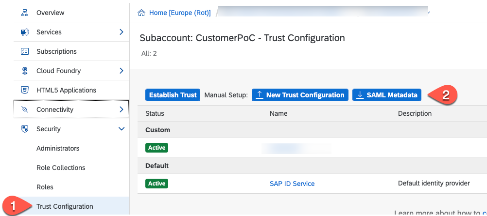
   
4. Now, open your company's Identity and Authentication Tenant (SAP IAS) and login to the same.
5. Select **Application & Resources** > Application from left pane.
6. Choose **Create**.
   
   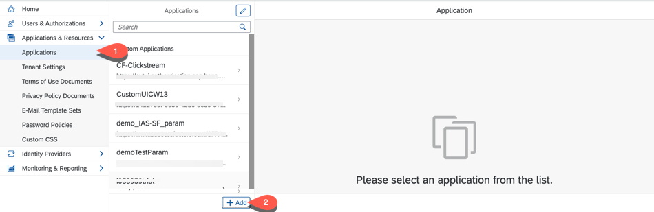
   
7. Enter Name. For eg., **ExtendUI\_IDP** and choose **SAP BTP solution** as **Application Type**
8. Select **Save**.

   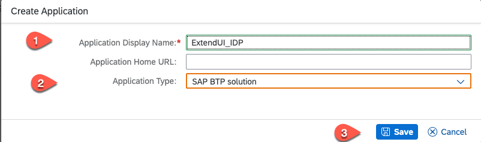
9. Choose **SAML 2.0 Configuration** under Trust Tab.
   
   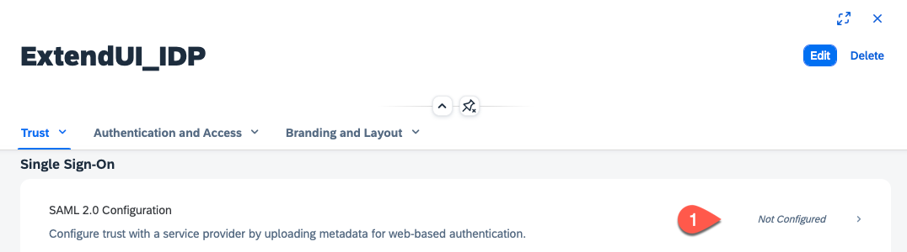
10. Seletct **Browse** for Metadata file upload. Choose the metadata xml file downloaded from previous step number 3.

   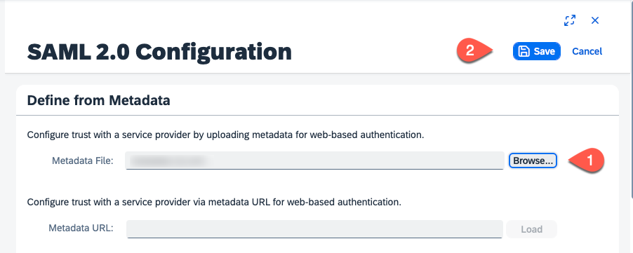   
11. Click on Save button.
12. Click on **Subject Name Identifier**
    
   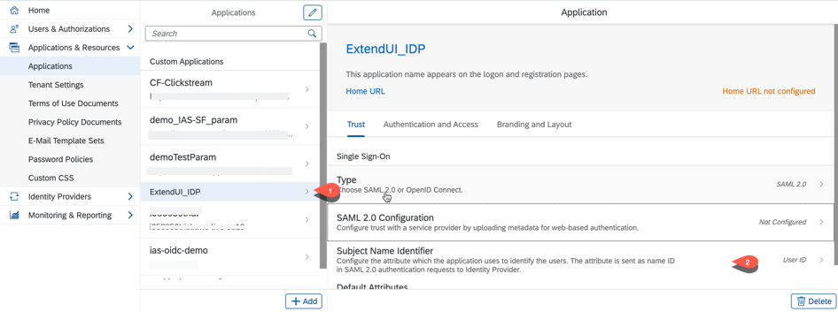 
   
13. Choose basic attribute as E-mail and Click on Save button.
   
   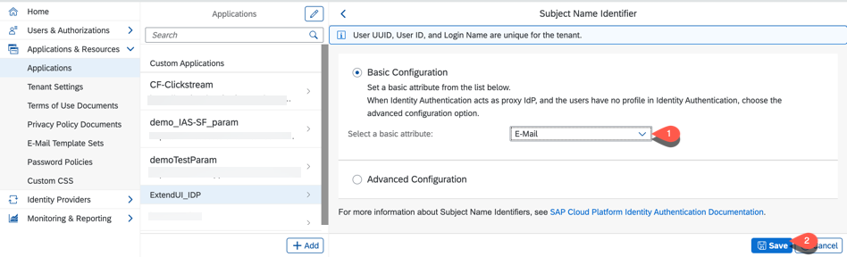 

14. Select Assertion Attributes
    
    

15. Click on Add and select the Groups attribute, set the assertion attribute to "Groups" with capital G. Click on save
 
     

16. In the Home view select User Groups

   

17. Create an Extension Developer group. 
    * Select **Create**
    * Set Name = ExtensionDeveloper
    * Set Display name = ExtensionDeveloper
    * Enter a description
    * Press **Create**

   

18.  Create an Extension Administrator group. Same steps as before.     
     * Select **Create**
     * Set Name = ExtensionAdministrator
     * Set Display name = ExtensionAdministrator
     * Enter a description
     * Press **Create**
  
19. Map the group to a user which should have the UX extension developer role. 
    * Open User Management
    * Select the user  
    * Click on User Groups
    * Press **Assign Groups**
   
   

20. Check the ExtensionDeveloper group and click on save.
   
   

    Repeat the last 2 steps for all user that needs the extension developer privilege.

21. Repeat steps 19&20 by mapping the **ExtensionAdministrator** group to all users that should have the UX extension administrator role. 

### Establish Trust with a custom SAML 2.0 Identity Provider in your Subaccount
You have your company's SAML 2.0 identity provider, for example, SAP Cloud Identity Authentication service. This is where your business users are stored. You must establish a trust relationship with your custom SAML 2.0 identity provider in your subaccount in SAP BTP. The following procedure describes how you establish trust in the SAP Cloud Identity Authentication service.

1. Click on **Application & Resources** > Tenant settings from the left pane.
2. Click on SAML 2.0 Configuration.

   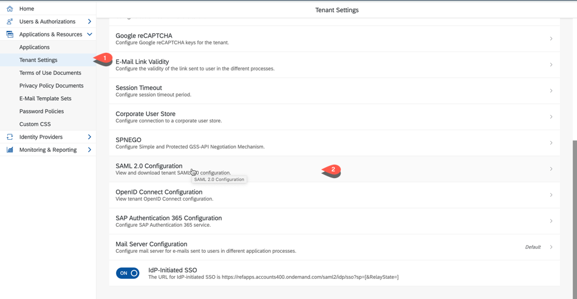 
   
3. Click on Download Metadata file button.

   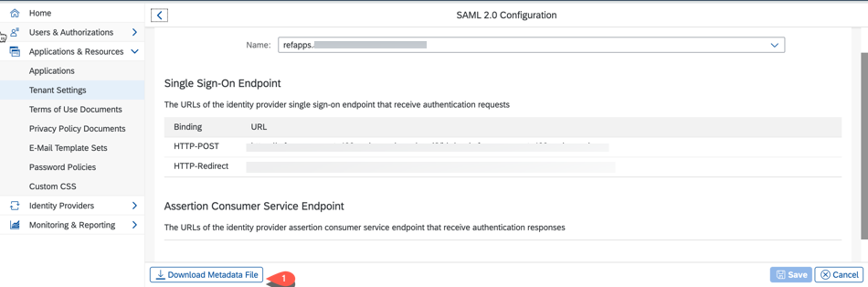
   
4. Now, login again to your CF subaccount and choose Security > Trust Configuration.
5. Click on New Trust Configuration button.
 
   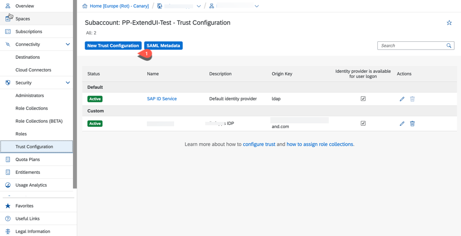
   
6. Click on **Upload** to upload metadata file. Choose the Tenant metadata file downloaded from previous step.
7. Enter Name. For eg., **ExtendUI-Tenant**
   
   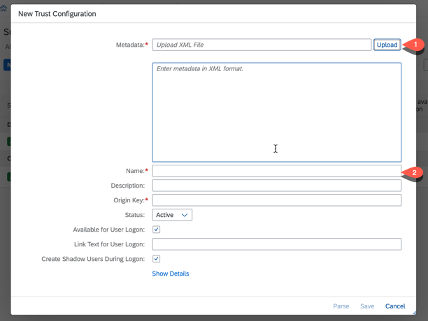
   
8. Click on **Save**.
9. Now assign the created Identity Provider groups with the role collections of your subaccount in SAP BTP by following the steps [Map IDP Groups with Role Collection](./AutomaticTrust.md#map-idp-groups-with-role-collection).

### References
Check the [official SAP Help documentation](https://help.sap.com/viewer/65de2977205c403bbc107264b8eccf4b/Cloud/en-US/7c6aa87459764b179aeccadccd4f91f3.html).
