# Setup of a SAP Business Technology Platform subccount manually

## Introduction

**Abbreviation:** SAP Business Technology Platform = SAP BTP

For running the HTML5 mission you will need the following services in your SAP BTP account:

* SAP Business Application Studio
* SAP Build Work Zone, standard edition   
* SAP HTML5 Application (kernel service - no quota necessary)
* SAP Continuous Integration & Delivery Service (optional)

The entitlement differs for the pricing option of your account:

**Consumption-based SAP BTP Account:** 
No entitlement necessary. Be sure that you have enough credits to run the services.

**Subscription-based SAP BTP Account:** 
You have to create entitlements for the services above - [see also Entitlements and Quotas](https://help.sap.com/viewer/df50977d8bfa4c9a8a063ddb37113c43/Cloud/en-US/38ecf59cdda64150a102cfaa62d5faab.html#loio363f0f68f9704830ac65c87a2562559b).

[Check the costs with the SAP BTP Estimator Tool](https://www.sap.com/products/cloud-platform/pricing/estimator-tool.html)

**Free Tier option with Pay-as-you-go (PAYG) or Cloud Platform Enterprise Agreement (CPEA) account** or **SAP Business Technology Platform Trial**

Free tier is not a distinct account but a set of entitlement plans within a consumption-based (PAYG/CPEA) global account for activating certain services for free.

Note: "free tier" only applies for services in SAP Business Technology Platform.

In this mission all the services from the SAP BTP are available in 'free' service plan, so check the following steps to create subscriptions to services and to assign relevant roles to your SAP BTP User.

You can also use a trial account in SAP BTP in this mission, another offering by SAP to test SAP BTP capabilities for free. The trial account is an isolated global account in SAP BTP. The subaccounts that you create come with pre-allocated service entitlements. After your trial account has been deleted, either on purpose or automatically, if you don’t use it for 365 days, all data and artifacts are deleted permanently.

To create and set up a trial account, see the [Get a Free Account on SAP BTP Trial](https://developers.sap.com/tutorials/hcp-create-trial-account.html) tutorial in the Tutorial Navigator.

**Persona:** Cloud Administrator

## Set up of a SAP BTP Subaccount

### Create subaccount manually in SAP BTP cockpit and enable Cloud Foundry

   
1. Login to your global SAP BTP account or your SAP BTP Trial account. 

   > If you are using a SAP BTP Trial Account, subaccount and a development space are already created, so you can skip step 2,3 and step 7.
   
2. Choose **Create** and select **Subaccount** to create a SAP BTP sub-account.
   
   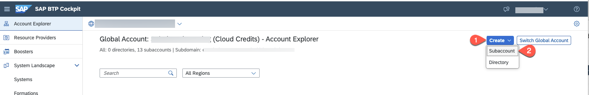

3. Enter a **Display Name**, **Subdomain** and select your suitable **Region** and choose **Create** to create your sub-account. 

   > Kindly check if the region you select contains the necessary services needed for this mission, [see SAP BTP Regions and Service Portfolio ](https://help.sap.com/doc/aa1ccd10da6c4337aa737df2ead1855b/Cloud/en-US/3b642f68227b4b1398d2ce1a5351389a.html).
   
   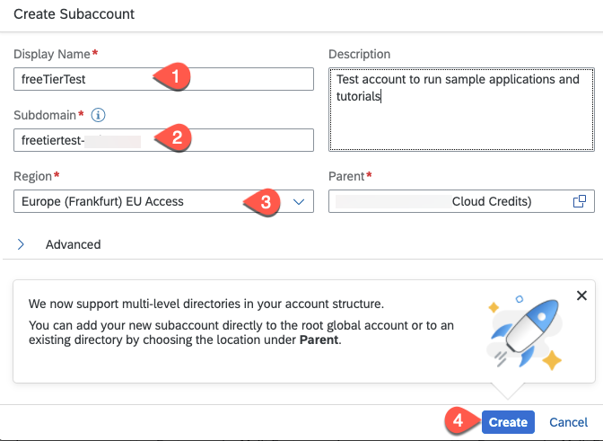

4. Once your subaccount is created, select **Go to Overview** to see your subaccount.
    
    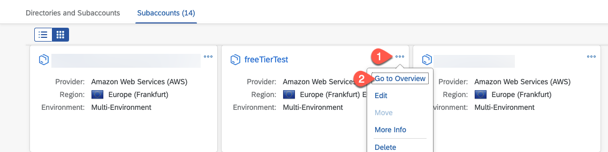
    
5. Choose **Enable Cloud Foundry** to use Cloud Foundry capabilities in your subaccount.

   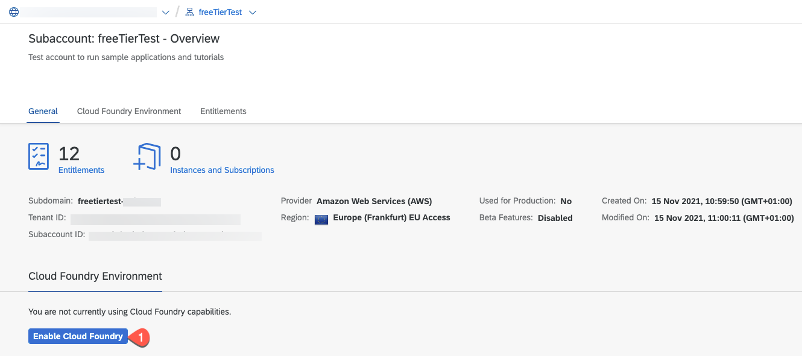
   
6. You can either give a new unique OrgName or leave the defaults and choose **Create** to enable Cloud Foundry capabilities in your subaccount.

   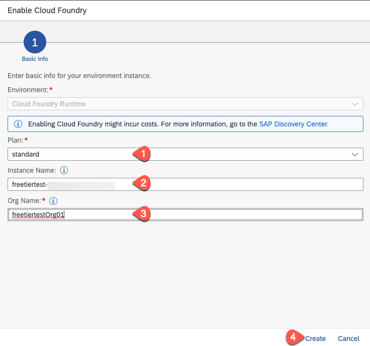

7. Choose **Create Space** and enter a space name. Your current user will get the **Space Manager** and **Space Developer** rights.
   > Optionally, you can assign additional team members if they need access as well by opening the created space and then selecting **Members** tab and choose **Add Members**.

   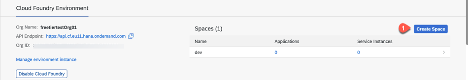

### Add Entitlements for the necessary Services

> If you are using a trial account you have to skip this section.

1. In the SAP BTP subaccount overview page select **Entitlements** and the choose **Configure Entitlements**
   
   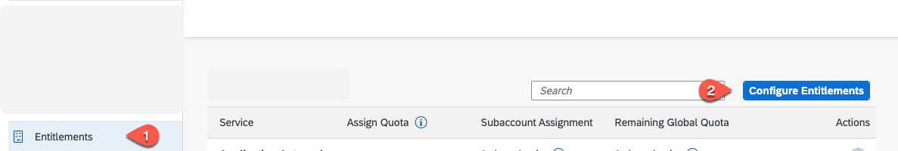
2. Select **Add Service Plans**
   
   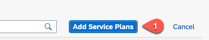

3. Search for **SAP Business Application Studio** and select the **free (Application)** plan
   
   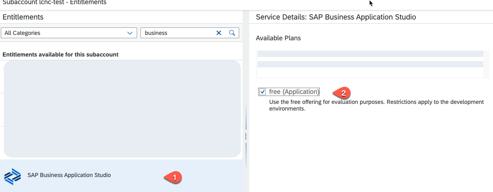 

4. Search for **Build Work Zone, standard edition Service** and select the **free (Application)** plan or the **standard** plan (**standard** plan costs estimate are in [SAP Build Work Zone, standard edition](https://discovery-center.cloud.sap/serviceCatalog/sap-build-work-zone-standard-edition?region=all&tab=service_plan)
   
   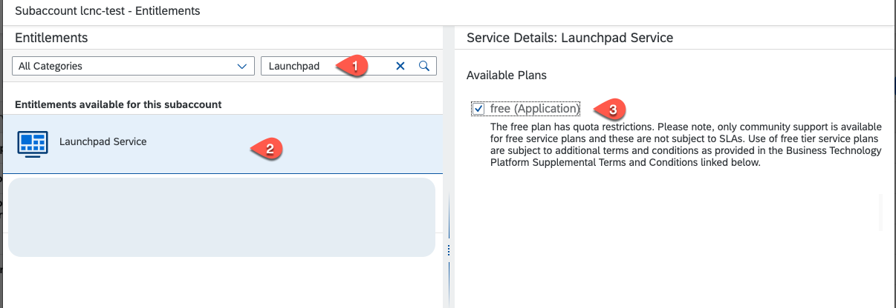

5. Search for **Continous Integration & Delivery** and select the **free (Application)** plan
   
   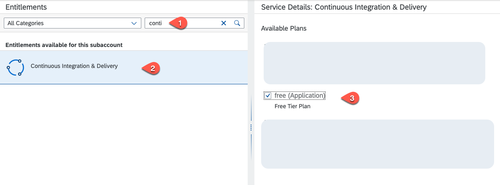

6. Add the 3 Service Plans
   
   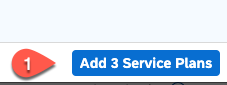

7. In the **Entitlements** overview page choose **Save** 
   
   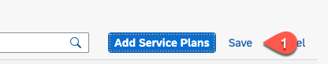

### Subscribe to neccessary Services

1. In your SAP BTP subaccount, choose **Instances and Subscriptions** and then choose **Create**.
   
   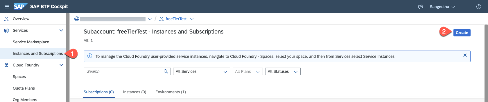
   
2. Select **SAP Business Application Studio** and choose **free** Plan and choose **Create**. If you are using the SAP BTP trial account choose the **standard** or **trial** plan. 

   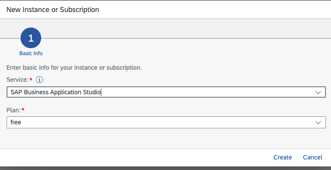

3. Repeat the above step also to create a subscription for **SAP Build Work Zone, standard edition** service and optionally to **Continous Integration and Delivery** service.

### Assign role collections to BTP users

1. In your subaccount, let us check and assign Org Members role, Select **Org Members** in the Cloud Foundry submenu. Choose **Add Members** and assign additional team members who need the administrator or "Organization Manager" role. 
   
     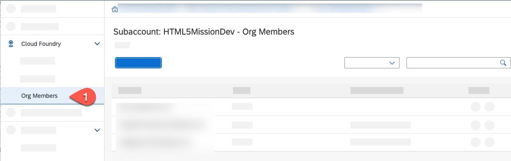

2. Let us now assign relevant role collections to your user. Select **Security** - Open the Security section and select **Users**. Again you should see all the users who have access to this sub-account. Click on your user and select **Assign role Collection** to assign relevant roles to access SAP Business Application Studio and SAP Build Work Zone, standard edition service. Also you need roles for accessing **Continous Integration and Delivery service**.

     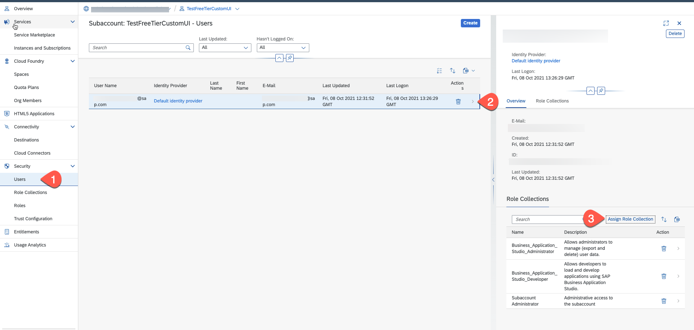

3. Kindly check and assign relevant roles to access  **Business Application Studio**, **Build Work Zone, standard edition** and optiinally **Continous Integration & Delivery service** and also assign roles to manage Cloud Connector, Destinations, Subaccount Administrator. Repeat the steps to assign more team members relevant role collections.

     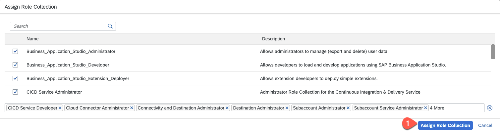
   

    | List of necessary role collections | 
    |-------------------------------------------|
    | Business_Application_Studio_Administrator | 
    | Business_Application_Studio_Developer | 
    | CICD Service Administrator | 
    | Launchpad_Admin | 
    | Subaccount Service Administrator| 
     
4. Let us check if you have access to the Subscribed applications. Go back to the Overview of your BTP subaccount.

5. Click **Services** and then choose **Instances and Subscriptions**. Select the tab **Subscriptions**, You should see the subscribed services:

    * SAP Business Application Studio
    * Build Work Zone, standard edition
    * Continuous Integration & Delivery Service (optional)
  
   Click on "Go to Application" to see if you're able to access the subscriptions. (You might have to logout and login or try in a new private window so that the roles you assigned recently works successfully).

   
   
   

### References

* [Setup of SAP BTP Environment](https://help.sap.com/viewer/368c481cd6954bdfa5d0435479fd4eaf/Cloud/en-US/302b47b11e1749c3aa9478f4123fc216.html) gives you a general overview of a SAP BTP Cloud Foundry account.

  
* [Setup SAP Business Application Studio](https://help.sap.com/viewer/9d1db9835307451daa8c930fbd9ab264/Cloud/en-US/6331319fd9ea4f0ea5331e21df329539.html)
  
    * Subscribe to SAP Business Application Studio
    * Manage Authorization and Rules
  

* [Setup Build Work Zone, standard edition](https://help.sap.com/viewer/8c8e1958338140699bd4811b37b82ece/Cloud/en-US/fd79b232967545569d1ae4d8f691016b.html)

    * Intital Setup - Accessing the SAP Build Work Zone, standard edition service

* [Setup SAP Continous Integration and Delivery](https://help.sap.com/viewer/99c72101f7ee40d0b2deb4df72ba1ad3/Cloud/en-US/719acaf61e4b4bf0a496483155c52570.html)
  
    * Enabling the service
    * Assigning Roles and Permissions

