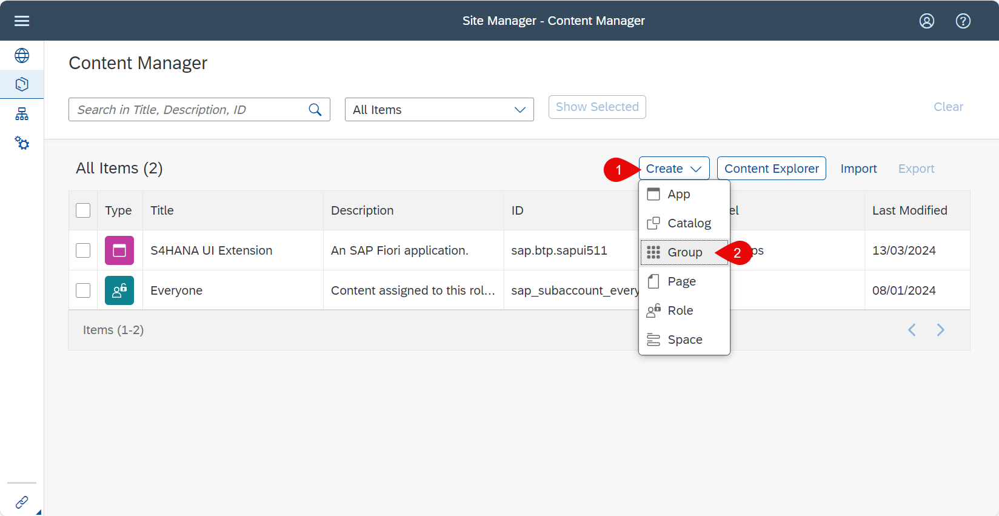
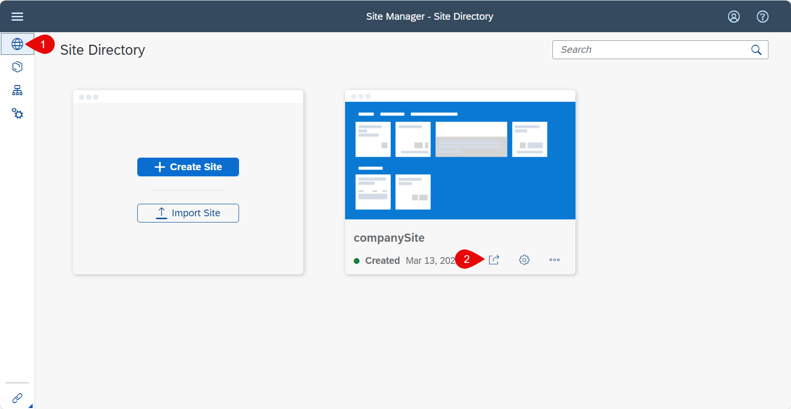

# Integrate the Application with SAP Build Work Zone, standard edition

## Introduction

In this section, we would describe steps of how you can add your HTML5 application to the  SAP Build Work Zone, standard edition. This allows to have one central entry point by building a company site to show all of your SAP BTP HTML5 applications.

**Persona:** SAP Workzone Administrator

**Abbreviation:** SAP Business Technology Platform = SAP BTP

## Step-by-Step

### Open Business Application Studio and login to Cloud Foundry

1. Let us open the service **Business Application Studio** by following the steps described in [Open SAP Business Application Studio](../create-application/develop/README.md#open-sap-business-application-studio).
2. If your workspace is stopped, click **Start** to start your dev space and click the name of your dev space to open your workspace.

   

3. Login to Cloud Foundry following the steps described in [Login to CF](../create-application/develop/README.md#login-to-cloud-foundry-in-sap-business-application-studio).


### Integrate your HTML5 application with SAP Build Work Zone, standard edition

In order that your HTML5 applications are visible to the SAP Build Work Zone, standard edition, you have currently to add some information to the manifest.json file. This information is added automatically by the [Create Project from Template wizard](https://github.com/SAP-samples/cloud-extension-html5-sample/tree/mission/mission/create-application/develop#develop-the-application-from-project-template) if you have chosen **Yes** to add SAP Build Work Zone, standard edition (renamed from SAP Launchpad) Configuration. You can also add the code snippet in step 3 manually. The HTML5 applications you want to expose must be deployed to the same subaccount as the SAP Build Work Zone service. 

For more information, check [Run Applications in SAP Build Work Zone, standard edition](https://help.sap.com/docs/WZ_STD/8c8e1958338140699bd4811b37b82ece/490a93e539e445e6b4bf7a6e7a3f4874.html).


1. Switch to the browser window with **SAP Business Application Studio** and open the Workspace containing your HTML5 project.
2. Expand your HTML5 project and open the manifest.json file which is under the folder sapui5 -> webapp -> manifest.json 
3. Open the manifest.json and check if the following source code snippet inside the **sap.app** section is already added automatically from the Project creation wizard. If you don't have this code snippet, add the following snippet manually. Do not forget to add a **,** to this **sap.app** section before you add the code below.

   ```
   "crossNavigation": {
            "inbounds": {
                "intent1": {
                    "signature": {
                        "parameters": {},
                        "additionalParameters": "allowed"
                    },
                    "semanticObject": "BusinessPartners",
                    "action": "display",
                    "title": "BusinessPartners",
                    "info": "List of BusinessPartners",
                    "icon": "sap-icon://BusinessSuiteInAppSymbols/icon-business-partner"
                }
            }
        }
   ```
4. In order that data of the extension application is displayed correctly in the SAP Build Work Zone site, check also the value of **sap.cloud** in webapp/manifest.json file.

   

5.  You have to now build and deploy the application with these changes, refer to [Build, Deploy and Run HTML5 Application on SAP BTP](../create-application/buildDeploy/README.md).

### Create a SAP Build Work Zone Site

1. Login to your SAP BTP account.
2. Check if your user has access to open SAP Build Work Zone, standard edition, check and assign the role collection **Launchpad_admin** to your user following [Assign Role for SAP Build Work Zone, standard edition](https://help.sap.com/viewer/8c8e1958338140699bd4811b37b82ece/Cloud/en-US/fd79b232967545569d1ae4d8f691016b.html). Your user would have automatically got the necessary roles if you have [created a BTP account using the boosters](../scp-setup/README.md).
2. Click **Services** and choose **Instances and Subscriptions**. 
3. Select the tab **Subscriptions**, Search for the application SAP Build Work Zone, standard edition and choose the icon to open it. click the three dots **...** to open the relevant **Actions**. Click **Go to Application** to open **SAP Build Work Zone, standard edition** service. 

   
   
4. Enter your SAP BTP email and password or your custom Identity Provider credentials to login to the application which opens in a separate browser tab.

5. Click on *Create Site* to create a company site.
   
   

6. Enter a site name, for example : *companySite* and click *Ok*.

   
   
7. Now we have created a company site. In the next step,let us create necessary Groups and Roles needed.

### Add HTML5 application to necessary Group and Role
  
1. Click on *Provider Manager* to check the Content Providers and to refresh the list of HTML5 Applications. 

   
   
2.  Click on *Fetch Updated Content* to manually fetch any new HTML5 applications deployed to the SAP BTP. This will fetch any new content deployed. Then click on *Content Manager* to look and add the HTML5 apps to SAP Work Zone site.

   
   
3. In *Content Manager*, click on *Content Explorer* tab and click on *HTML5 Apps* to see the list of HTML5 applications to be added.

    
    
4. Select your HTML5 application which you see in the list and click on *Add to Content*. 

   
   
5. Click on *My Content* tab and click on *New* and click on *Group* to create a new group.

   
   
6. Enter a group name, for example: **BusinessPartnersgroup** and a valid description.

   
   
7. Now in the *Assignments* section, search for *S4HANA* and add the listed HTML5 app by clicking **+** to the new group. Click **Save** to save the changes.

    

8. Check the assigned App to the newly created group and click **<** to go the previous screen.

   
   
9. Click on *Everyone* role to assign our HTML5 Application for testing purposes. You can create your company specific roles and assign the HTML5 applications accordingly.

   
   
10. Click **Edit** to edit the *Everyone* role.

    
   
11. In the *Assignments* section, search for **S4HANA** and add the listed HTML5 app by clicking **+**. Click **Save** to save the changes.

    
   
12. Check the assigned App to the *Everyone* role and click the Globe icon to go the *Site Directory*.

    
   


### Adding HTML5 application to the SAP Work Zone, standard edition site

1. In the Site Manager, you can see the company site, click **Go to site** to open the site.

   
   
2. Enter the email and password for opening the company site.
   
3. You can see the *BusinessPartners* application available as a tile in the company site. Click on the tile to open the application.

   
   
4. You can see that the **BusinessPartners** application opens in the company site which can be a central point of access for all your applications. 

   

### Result

You have successfully created a SAP Build Work Zone, standard edition site, giving necessary roles and groups and added your HTML5 application to have one central entry point to show all of your SAP BTP applications.
