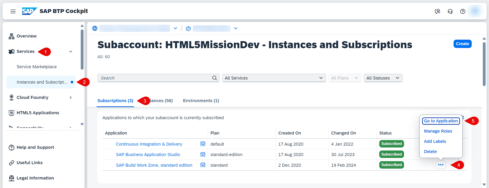
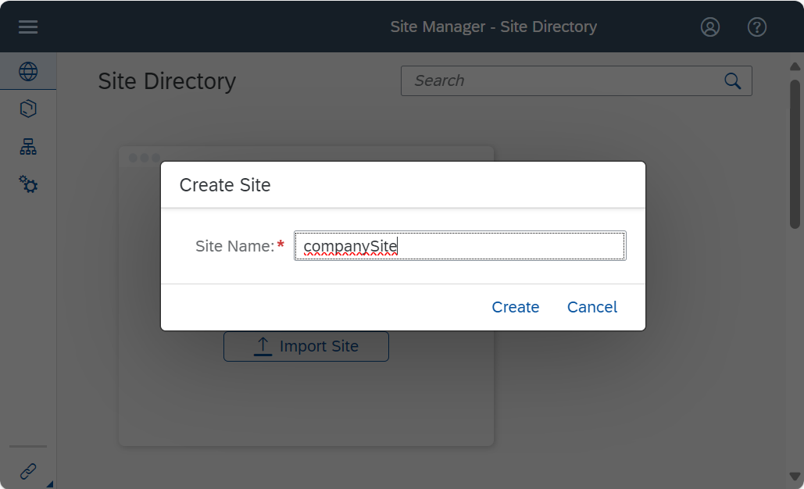
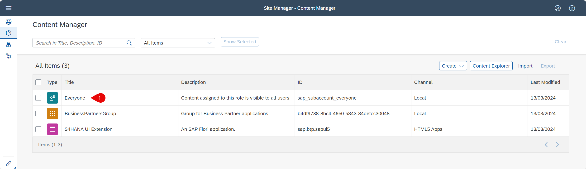
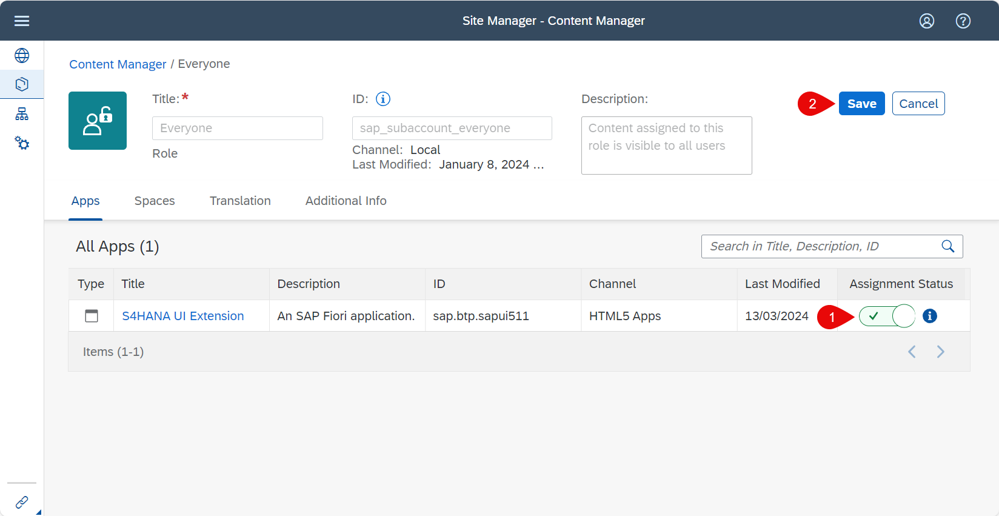

# Integrate the Application with SAP Build Work Zone, standard edition

## Introduction

In this section, we describe how you can add your HTML5 application to the  SAP Build Work Zone, standard edition. This allows to have one central entry point by building a company site to show all of your SAP BTP HTML5 applications.

For your HTML5 applications to be visible to the SAP Build Work Zone, standard edition, the manifest.json file needs information that is added automatically by the [Create Project from Template wizard](https://github.com/SAP-samples/cloud-extension-html5-sample/tree/mission/mission/create-application/develop) when you fill out the Fiori Launchpad Configuration. The HTML5 applications you want to expose must also be deployed to the same subaccount as the SAP Build Work Zone service. For more information, see [Run Applications in SAP Build Work Zone, standard edition](https://help.sap.com/docs/WZ_STD/8c8e1958338140699bd4811b37b82ece/490a93e539e445e6b4bf7a6e7a3f4874.html).

**Persona:** SAP Workzone Administrator

## Step-by-Step

### Create a SAP Build Work Zone Site

1. Login to your SAP BTP subaccount.
2. Check if your user has access to open SAP Build Work Zone, standard edition. If not, assign the role collection **Launchpad_admin** to your user following [Assign Role for SAP Build Work Zone, standard edition](https://help.sap.com/viewer/8c8e1958338140699bd4811b37b82ece/Cloud/en-US/fd79b232967545569d1ae4d8f691016b.html). Your user would have automatically got the necessary roles if you have [created a BTP account using the boosters](../scp-setup/README.md).
3. Click **Services** and choose **Instances and Subscriptions**. Select the tab **Subscriptions**. In the row with **SAP Build Work Zone, standard edition**,  click the three dots **...** to open the relevant **Actions** and then click **Go to Application**.

   
   
4. Enter your SAP BTP email and password or your custom Identity Provider credentials to login to the application which opens in a separate browser tab.

5. In the **Site Manager**, click on **Create Site**.
   
   

6. Enter a site name, for example : **companySite** and click **Create**.

   
   
We have created a company site. In the next step, let us create the necessary Groups and Roles.

### Add HTML5 application to necessary Group and Role
  
1. Click on **Channel Manger** to check the Content Providers and to refresh the list of HTML5 Applications. 

   

2. Click on **Update content** to manually fetch any new HTML5 applications deployed to the SAP BTP. Then click on **Content Manager**, where you will add the HTML5 apps to the site. 
   
   
3. In **Content Manager**, click on **Content Explorer**.

    

4. Click on **HTML5 Apps** to see the list of HTML5 applications to be added.

    
    
5. Select your HTML5 application which you see in the list and click on **Add to Content**. 

   
   
6. In the **Content Manager**, click on **Create** and then click on **Group**.

   
   
7. Enter a group name, for example: **BusinessPartnersgroup**, and a description. Under **Assignment Status**, use the switch to assign your app, then click **Save**.

   
   
8. Go to the **Content Manager**.
   
9. Click on the **Everyone** role to assign our HTML5 Application for testing purposes. You can create your company specific roles and assign the HTML5 applications accordingly.

   
   
10. Click **Edit** to edit the **Everyone** role.

    
   
11. Under **Assignment Status**, use the switch to assign your app, then click **Save**.

    
   
 

### Adding HTML5 application to the SAP Work Zone, standard edition site

1. In the **Site Manager**, you can see the company site. Click **Go to site**.

   
   
2. Login to the site which opens in a separate browser tab.
   
3. You can see the **Business Partners** application available as a tile in the company site. Click on the tile to open the application.

   
   
4. You can see that the **Business Partners** application opens in the company site which can be a central point of access for all your applications. 

   

5. See that the application works as before.

   

### Result

You have successfully created a SAP Build Work Zone, standard edition site, giving necessary roles and groups and added your HTML5 application to have one central entry point to show all of your SAP BTP applications.
