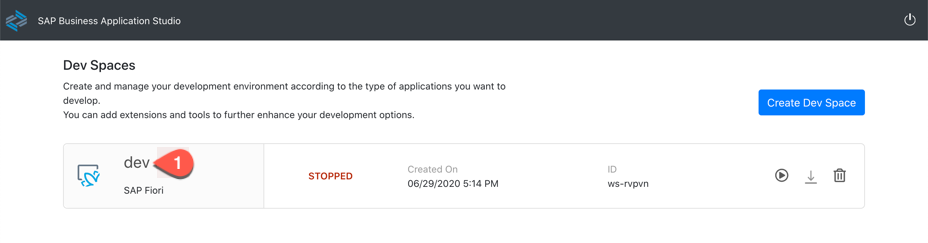
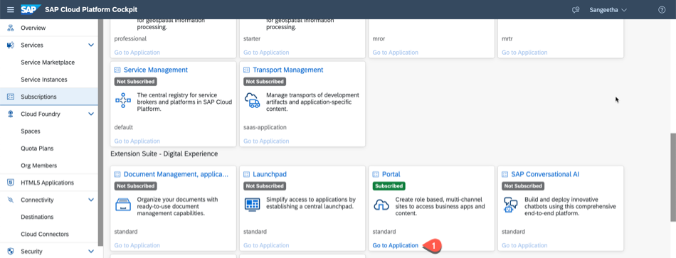
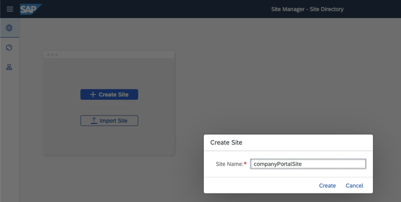
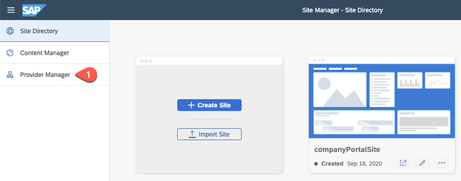
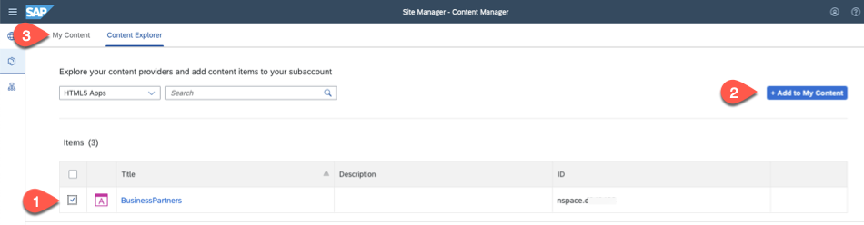
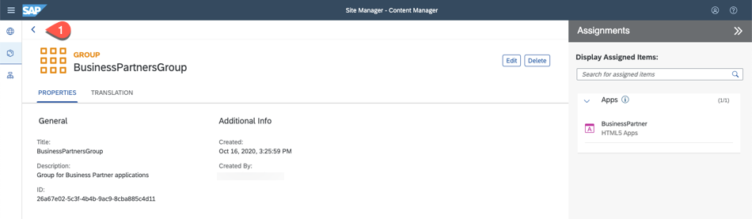
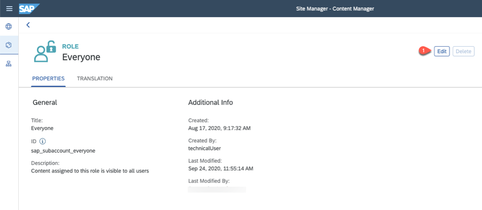
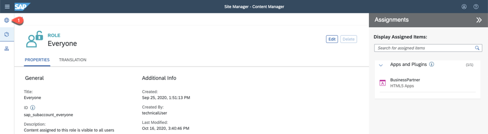
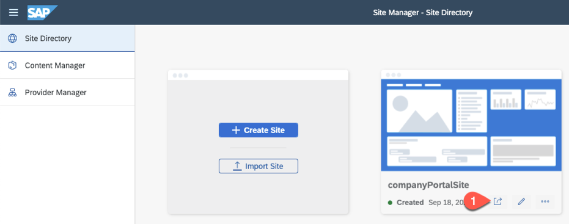
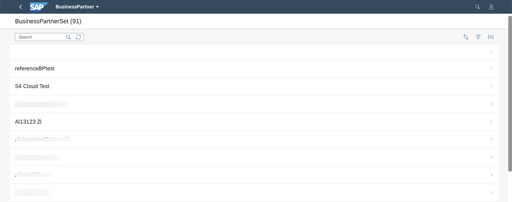

# Publishing your application to a Portal site

## Introduction

In this section, we would describe steps of how you can add your HTML5 application to the Portal and how you can build a company site with the HTML5 application.

**Persona:** Portal Administrator


## Step-by-Step

### Open Business Application Studio and login to Cloud Foundry

1. Login to your SAP Cloud Platform account. 
2. Goto your Subaccount and click on Subscriptions. 
3. Search for **SAP Business Application Studio** and click on 'Go to Application'. 

   
   
4. You would be prompted with a login screen of the custom Identity Provider what you have configured.
5. Login to the Application using your custom Identity Provider credentials.
6. If your workspace is stopped, 'Start' it and then Open your previously created 'dev' workspace.

   
   
7. Check if you are logged in to your Cloud Platform Account from *SAP Business Application Studio*.
8. To login to Cloud Foundry, In the tabs, click on View-> Select “Find Command”.
9. Search for “CF Login”.
10. Select for “CF: Login on to Cloud Foundry”.

     
    
11. Enter CF API endpoint or take the default suggested API endpoint. You can find the API endpoint of your region by switching into your SAP Cloud Platform account browser window and copy the API Endpoint. Also write down the 'Org Name' into a text editor of your choice which is needed for the next step.  

    
    
12. Choose 'Spaces' and write down the space name to a text editor of your choice. 

    
     
13. Enter “Email” and “Password” when prompted.
14. Select your Cloud Foundry "Org" which you have noted down in step 11. 
15. Select the space name which you have noted down in step 12. Once you have selected the Org and Space, you would login to Cloud Foundry in SAP Business Application Studio.

### Expose HTML5 Applications in Portal

In order that your HTML5 applications are visible to the Portal application, you have to currently add some information to the manifest.json file manually. The HTML5 applications you want to expose must be deployed to the same subaccount as the Portal. For more information, check [Expose HTML5 Applications in Portal](https://help.sap.com/viewer/ad4b9f0b14b0458cad9bd27bf435637d/Cloud/en-US/3a0e6d6b791c4c2189f6a0a424188362.html).


1. Switch to the browser window with **Business Application Studio** and open the Workspace containing your HTML5 project.
2. Expand your HTML5 project and open the manifest.json file which is under the folder BP -> webapp -> manifest.json 
3. Open the manifest.json and add the following source code inside the "sap.app" section. Do not forget to add a "," to this "sap.app" section before you add the code below.

   ```
   "crossNavigation": {
            "inbounds": {
                "intent1": {
                    "signature": {
                        "parameters": {},
                        "additionalParameters": "allowed"
                    },
                    "semanticObject": "BusinessPartners",
                    "action": "display",
                    "title": "BusinessPartners",
                    "info": "List of BusinessPartners",
                    "icon": "sap-icon://BusinessSuiteInAppSymbols/icon-business-partner"
                }
            }
        }
   ```
4.  You have to now build and deploy the application with these changes, refer to [Build, Deploy and Run HTML5 Application on SAP Cloud Platform](../create-application/buildDeploy/README.md).

### Create a Portal Site

1. Login to your SAP Cloud Platform account. 
2. Goto your Subaccount and click on Subscriptions. 
3. Search for **SAP Business Application Studio** and click on 'Go to Application'. If you are not subcribed, first "Subscribe" to Portal and then open the application. 


   
   
4. Enter your SAP Cloud Platform Email and password to login to the Portal Application which opens in a separate browser tab.

5. Click on *Create Site* to create a company Portal site.
   
   

6. Enter a site name, for example : *companyPortalSite* and click *Ok*.

   
   
7. Now we have created a portal site. In the next step,let us create necessary Groups and Roles needed.

### Add HTML5 application to necessary Group and Role
  
1. Click on *Provider Manager* to check the Content Providers and to refresh the list of HTML5 Applications. 

   
   
2.  Click on *Fetch Updated Content* to manually fetch any new HTML5 applications deployed to the SAP Cloud Platform. This will fetch any new content deployed. Then click on *Content Manager* to look and add the HTML5 apps to portal site.

   
   
2. In *Content Manager*, click on *Content Explorer* tab and click on *HTML5 Apps* to see the list of HTML5 applications to be added to the portal site.

    
    
3. Select your HTML5 application which you see in the list and click on *Add to Content*. 

   
   
4. Click on *My Content* tab and click on *New* and click on *Group* to create a new group.

   
   
5. Enter a group name, for example: 'BusinessPartnersgroup' and a valid description.

   
   
6. Now in the *Assignments* section, search for *BusinessPartner* and add the listed HTML5 app by clicking '+' to the new group. Click 'Save' to save the changes.

    

7. Check the assigned App to the newly created group and click '<' to go the previous screen.

   
   
8. Click on *Everyone* role to assign our HTML5 Application for testing purposes. You can create your company specific roles and assign the HTML5 applications accordingly.

   
   
9. Click 'Edit' to edit the *Everyone* role.

   
   
10. In the *Assignments* section, search for *BusinessPartner* and add the listed HTML5 app by clicking '+'. Click 'Save' to save the changes.

   
   
11. Check the assigned App to the *Everyone* role and click the Globe icon to go the *Site Directory*.

   
   


### Adding HTML5 application to the portal site

1. In the Site Manager, you can see the company Portal site, click 'Go to site' to open the site.

   
   
2. Enter the email and password for opening the portal site.
   
3. You can see the *BusinessPartners* application available as a tile in the company portal site. Click on the tile to open the application.

   
   
4. You can see that the 'BusinessPartners' application opens in the portal site successfully as below. 

   

### Result

You have successfully created a portal site, giving necessary roles and groups and added your HTML5 application to the portal site.
