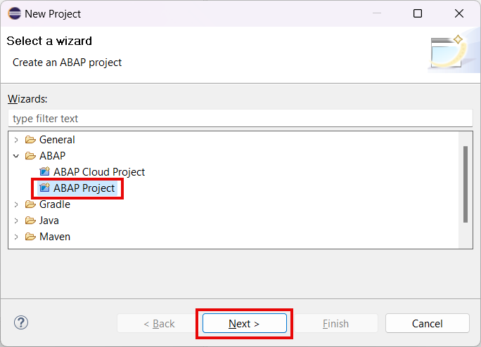

# Set up the ABAP Development Tools

## Introduction 

In this exercise, you will connect your development environment to the S/4HANA system instance to enable API development.

## Prerequisites

You should have [ABAP Development Tools](https://tools.eu1.hana.ondemand.com/#abap) installed.

## Content

1. Open Eclipse application and choose menu option **File** &rarr; **New** &rarr; **Project...**

2. Select **ABAP Project** wizard in the **ABAP** folder and choose **Next**.

   

3. Enter the connection details for your S/4HANA system (using **Custom Application Server** or **Group Selection** connection type) and choose **Next**.

  

> Ask your S/4HANA System Administrator for the corresponding information to fill the connection settings.

4. On the next screen enter your credentials and fill the development client number. Then choose **Finish**.

   

5. Confirm **Open Perspective** if you are asked to switch to the ABAP perspective.

  

## Result

You have now created an ABAP project in your Eclipse IDE. 

## Further reading / Reference Links

- [Create an ABAP Project in ABAP Development Tools (ADT)](https://developers.sap.com/tutorials/abap-create-project.html)
