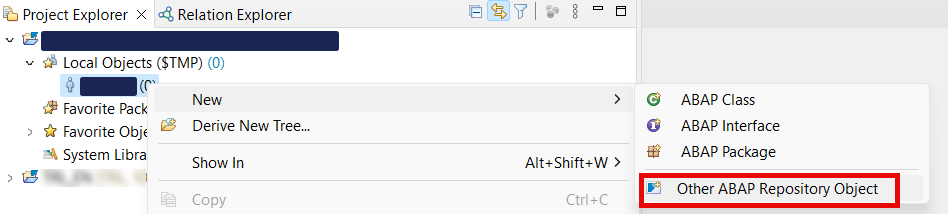
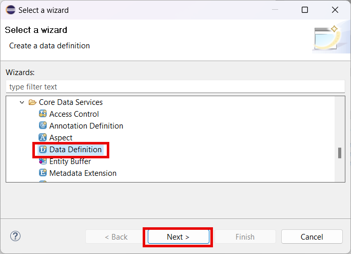
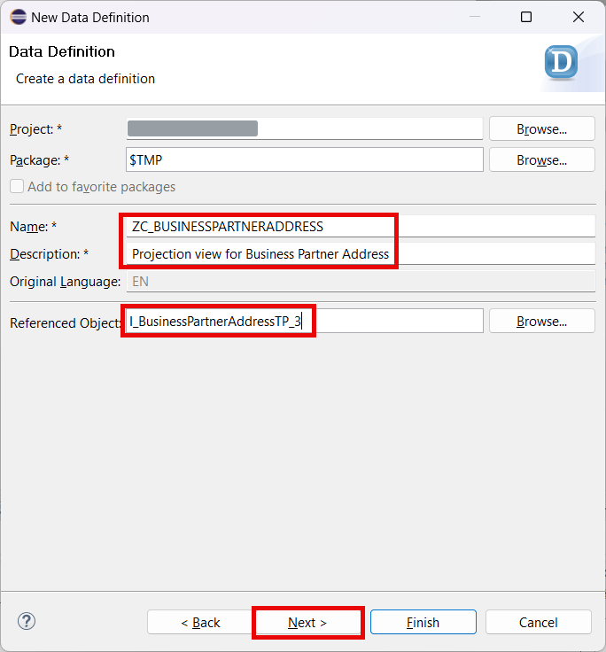
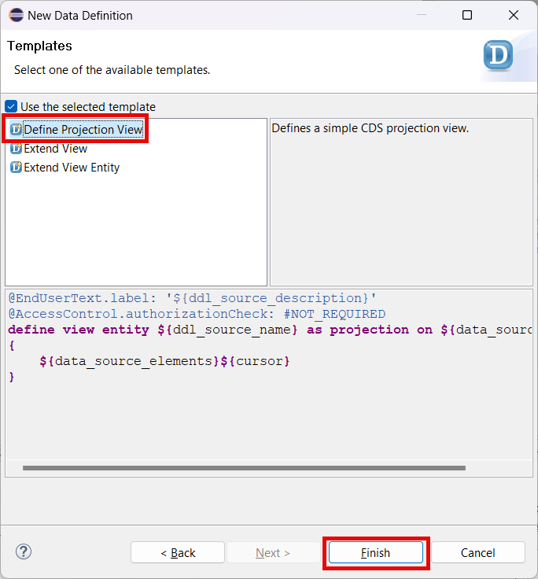
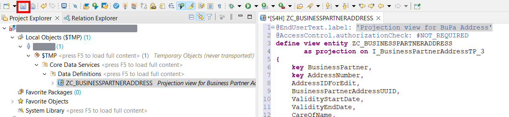
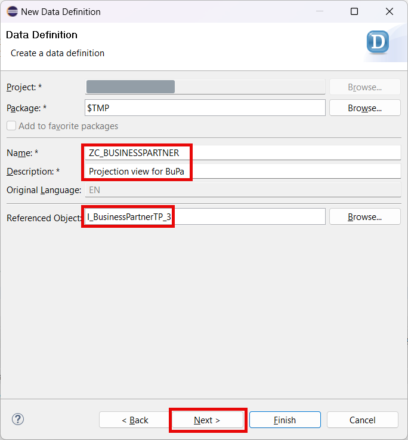
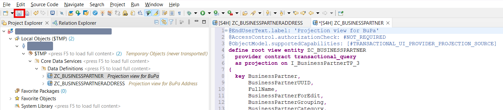
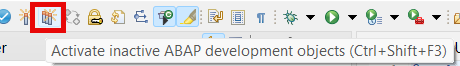
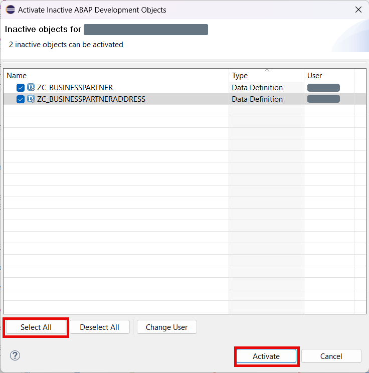

# Create the Data Definition

## Introduction 

In this exercise, you will create CDS view projections which will represent the data model of your service. These projections will be based on the Business Object interface `I_BusinessPartnerTP_3` and its child composition `I_BusinessPartnerAddressTP_3` which are released by SAP for Developer Extensibility.

> In this tutorial all objects will be stored as local for simplicity reasons. No transport landscape is used. Create package assigned to a transport for productive scenarios.

## Task Flow  

In this exercise, you will perform the following tasks:

1. Create projection for Business Partner Address
2. Create root projection for Business Partner

## Content

### Task 1: Create projection for Business Partner Address

1. Right click on your user name under the node **Local Objects ($TMP)** in your workspace.

2. Choose **New** &rarr; **Other ABAP Repository Object** option in the context menu.

   

3. Choose **Data Definition** in the **Core Data Services** folder and then choose **Next**.

   

4. Enter the following data and then choose **Next**:
  - **ZC_BUSINESSPARTNERADDRESS** in the **Name** field
  - **Projection view for BuPa Address** in the **Description** field
  - **I_BusinessPartnerAddressTP_3** in the **Referenced Object** field

  

5. Skip the next screen by choosing **Next**.

6. On the next screen select the **Define Projection View** template and then choose **Finish**.

  

7. Replace the code of the view with the one below and then choose **Save** button.

> NOTE: You will probably notice that there's an error in the code below. That happens because we have cross-links between both objects (from parent to child and vice versa). These objects cannot be activated one by one. So we will save them both and then activate at once. So no worries about any error message in this step.

~~~abap
@EndUserText.label: 'Projection view for BuPa Address'
@AccessControl.authorizationCheck: #NOT_REQUIRED
@Metadata.allowExtensions: true
@VDM.viewType: #CONSUMPTION
define view entity ZC_BUSINESSPARTNERADDRESS 
       as projection on I_BusinessPartnerAddressTP_3
{
    key BusinessPartner,
    key AddressNumber,
    AddressIDForEdit,
    BusinessPartnerAddressUUID,
    ValidityStartDate,
    ValidityEndDate,
    CareOfName,
    StreetPrefixName,
    AdditionalStreetPrefixName,
    HouseNumber,
    StreetName,
    HouseNumberSupplementText,
    StreetSuffixName,
    AdditionalStreetSuffixName,
    HomeCityName,
    District,
    DistrictName,
    PostalCode,
    CityName,
    Country,
    Region,
    AddressTimeZone,
    TransportZone,
    TaxJurisdiction,
    CompanyPostalCode,
    DeliveryServiceTypeCode,
    DeliveryServiceNumber,
    POBox,
    POBoxIsWithoutNumber,
    POBoxPostalCode,
    POBoxLobbyName,
    POBoxDeviatingCityName,
    POBoxDeviatingRegion,
    POBoxDeviatingCountry,
    CorrespondenceLanguage,
    PrfrdCommMediumType,
    AddressLine1Text,
    FormattedAddress,
    CompleteAddress,
    BPAddressIsProtected,
    StandardUsage,
    AddressNonDeliverableReason,
    PostBoxNonDeliverableReason,
    Building,
    Floor,
    RoomNumber,
    County,
    BPCountyText,
    DataControllerSet,
    DataController1,
    DataController2,
    DataController3,
    DataController4,
    DataController5,
    DataController6,
    DataController7,
    DataController8,
    DataController9,
    DataController10,
    
    _BusinessPartner: redirected to parent ZC_BUSINESSPARTNER
}
~~~

  

### Task 2: Create projection for Business Partner

1. Right click on your user name under the node **Local Objects ($TMP)** in your workspace.

2. Choose **New** &rarr; **Other ABAP Repository Object** option in the context menu.

   

3. Choose **Data Definition** in the **Core Data Services** folder and then choose **Next**.

   

4. Enter the following data and then choose **Next**:
  - **ZC_BUSINESSPARTNER** in the **Name** field
  - **Projection view for BuPa** in the **Description** field
  - **I_BusinessPartnerTP_3** in the **Referenced Object** field

  

5. Skip the next screen by choosing **Next**.

6. On the next screen select the **Define Projection View** template and then choose **Finish**.

  

7. Replace the code of the view with the one below and then choose **Save** button.

~~~abap
@EndUserText.label: 'Projection view for BuPa'
@AccessControl.authorizationCheck: #NOT_REQUIRED
@ObjectModel.supportedCapabilities: [#TRANSACTIONAL_UI_PROVIDER_PROJECTION_SOURCE]
@Metadata.allowExtensions: true
@VDM.viewType: #CONSUMPTION
define root view entity ZC_BUSINESSPARTNER
  provider contract transactional_query
  as projection on I_BusinessPartnerTP_3
{
  key BusinessPartner,
      BusinessPartnerUUID,
      @Semantics.text:true      
      FullName,
      BusinessPartnerForEdit,
      BusinessPartnerGrouping,
      @ObjectModel.text.association: '_BusinessPartnerCategory'            
      BusinessPartnerCategory,
      CreatedByUser,
      CreationDate,
      CreationTime,
      LastChangedByUser,
      LastChangeDate,
      LastChangeTime,
      FormOfAddress,
      FormOfAddressPerson,
      FirstName,
      LastName,
      AdditionalLastName,
      BusinessPartnerBirthName,
      MiddleName,
      AcademicTitle,
      AcademicTitle2,
      BusinessPartnerSupplementName,
      LastNamePrefix,
      LastNameSecondPrefix,
      PersonFullName,
      BusinessPartnerNicknameLabel,
      Initials,
      IsNaturalPerson,
      Language,
      CorrespondenceLanguage,
      BirthDate,
      BusinessPartnerBirthplaceName,
      BusinessPartnerBirthDateStatus,
      BusinessPartnerDeathDate,
      BusinessPartnerOccupation,
      BusPartNationality,
      BusPartMaritalStatus,
      IsMale,
      IsFemale,
      IsSexUnknown,
      GenderCodeName,
      AdditionalName,
      BusinessPartnerIDByExtSystem,
      NonResidentCompanyOriginCntry,
      NaturalPersonEmployerName,
      BusinessPartnerSalutation,
      FormOfAddressOrganization,
      OrganizationBPName1,
      OrganizationBPName2,
      OrganizationBPName3,
      OrganizationBPName4,
      LegalForm,
      LegalEntityOfOrganization,
      OrganizationFoundationDate,
      OrganizationLiquidationDate,
      InternationalLocationNumber1,
      InternationalLocationNumber2,
      InternationalLocationNumber3,
      ETag,
      FormOfAddressGroup,
      GroupBusinessPartnerName1,
      GroupBusinessPartnerName2,
      BusinessPartnerGroupType,
      AuthorizationGroup,
      BusinessPartnerKind,
      BusinessPartnerPrintFormat,
      BusinessPartnerDataOriginType,
      BusinessPartnerIsBlocked,
      IsMarkedForArchiving,
      BusinessPartnerIsNotReleased,
      ContactPermission,
      IsBusinessPurposeCompleted,
      SearchTerm1,
      SearchTerm2,
      BPFirstNameSearchHelp,
      BPLastNameSearchHelp,
      NameFormat,
      NameCountry,
      BusPartPersonDataIsHidden,
      BusPartOrgDataIsHidden,
      BusPartGroupDataIsHidden,
      BusPartAddrLanguageIsHidden,
      DataControllerSet,
      DataController1,
      DataController2,
      DataController3,
      DataController4,
      DataController5,
      DataController6,
      DataController7,
      DataController8,
      DataController9,
      DataController10,

      _BusinessPartnerAddress : redirected to composition child ZC_BUSINESSPARTNERADDRESS,
      _BusinessPartnerCategory
}
~~~

  

8. Choose **Activate inactive ABAP development objects** button.
   
  

9. Choose **Select All** button and then choose **Activate** button.

  

## Result

You have created and activated CDS view projections. These projections can be used now as a base for the service.

## Further reading / Reference Links

- [Naming convention](https://help.sap.com/docs/ABAP_PLATFORM_NEW/fc4c71aa50014fd1b43721701471913d/8b8f9d8f3cb948b2841d6045a255e503.html)
- [SAP Help: CDS Projection](https://help.sap.com/docs/abap-cloud/abap-rap/cds-projection-view)
- [CDS Projection Views in ABAP CDS: What’s Your Flavor](https://blogs.sap.com/2022/07/04/cds-projection-views-in-abap-cds-whats-your-flavor/)
- [ABAP Documentation: CDS Projection Views - Transactional Queries](https://help.sap.com/doc/abapdocu_latest_index_htm/latest/en-US/index.htm?file=abencds_pv_transactional_query.htm)
