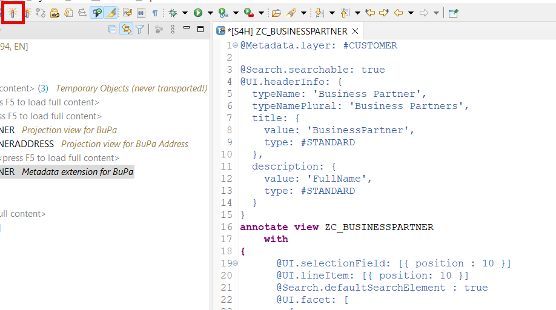

# Create Metadata Extensions

## Introduction 

In this exercise, you will create UI metadata extensions for your views. You need to have UI annotations to control the UI from the backend. The syntax of CDS will grow if complex annotations are needed. That may reduce the readability of CDS. A metadata extension separates annotations from business logic.

## Task Flow  

In this exercise, you will perform the following tasks:

1. Create metadata extension for ZC_BUSINESSPARTNER
2. Create metadata extension for ZC_BUSINESSPARTNERADDRESS

## Content

### Task 1: Create metadata extension for ZC_BUSINESSPARTNER

1. Right click on **ZC_BUSINESSPARTNER** view in **Project Explorer** and choose **New Metadata Extension**.

  

2. Enter the following data and then choose **Next**:
  - **ZC_BUSINESSPARTNER** in the **Name** field
  - **Metadata extension for BuPa** in the **Description** field
  - **ZC_BUSINESSPARTNER** in the **Extended Entity** field

  

3. Skip the next screen by choosing **Next**.

4. On the next screen select the **Annotate View** template and then choose **Finish**.

  

5. Replace the code of the extension with the one below and then choose **Activate** button.

~~~abap
@Metadata.layer: #CUSTOMER

@Search.searchable: true
@UI.headerInfo: {
  typeName: 'Business Partner',
  typeNamePlural: 'Business Partners',
  title: {
    value: 'BusinessPartner',
    type: #STANDARD
  },
  description: {
    value: 'FullName',
    type: #STANDARD
  }
}
annotate view ZC_BUSINESSPARTNER
    with 
{
      @UI.selectionField: [{ position : 10 }]
      @UI.lineItem: [{ position: 10 }]
      @Search.defaultSearchElement : true
      @UI.facet: [
        {
          label: 'General Information',
          targetQualifier: 'PersonalData',
          type: #FIELDGROUP_REFERENCE,
          purpose: #STANDARD
        },
        {
          id: 'Address',
          purpose: #STANDARD,
          type: #LINEITEM_REFERENCE,
          label: 'Address',
          position: 10,
          targetElement: '_BusinessPartnerAddress'
        }
      ]
      BusinessPartner;

      @EndUserText.label: 'Full Name'
      @UI.fieldGroup: [{position: 10}]
      FullName;
      
      @UI.selectionField: [{ position : 20 }]
      @UI.lineItem: [{ position: 40 }]
      @Consumption.valueHelpDefinition: [{ entity: {name: 'C_BusPartCategoryVH', element: 'BusinessPartnerCategory'}, useForValidation: true }]
      BusinessPartnerCategory;   
      
      @UI.lineItem: [{ position: 20 }]
      @Search.defaultSearchElement : true
      @UI.fieldGroup: [
        {
          type: #STANDARD,
          position: 10 ,
          qualifier: 'PersonalData',
          groupLabel: 'Personal Data'
        }
      ]
      FirstName;
      
      @UI.lineItem: [{ position: 30 }]
      @Search.defaultSearchElement : true
      @UI.fieldGroup: [
        {
          type: #STANDARD,
          position: 20 ,
          qualifier: 'PersonalData'
        }
      ]
      LastName;      
}
~~~

  

### Task 2: Create metadata extension for ZC_BUSINESSPARTNERADDRESS

1. Right click on **ZC_BUSINESSPARTNERADDRESS** view in **Project Explorer** and choose **New Metadata Extension**.

  

2. Enter the following data and then choose **Next**:
  - **ZC_BUSINESSPARTNERADDRESS** in the **Name** field
  - **Metadata extension for BuPa Address** in the **Description** field
  - **ZC_BUSINESSPARTNERADDRESS** in the **Extended Entity** field

  

3. Skip the next screen by choosing **Next**.

4. On the next screen select the **Annotate View** template and then choose **Finish**.

  

5. Replace the code of the extension with the one below and then choose **Activate** button.

~~~abap
@Metadata.layer: #CUSTOMER

@UI.headerInfo: {
  typeName: 'Address',
  typeNamePlural: 'Addresses',
  title: {
    value: 'AddressNumber',
    type: #STANDARD
  },
  description: {
    value: 'CityName',
    type: #STANDARD
  }
}
annotate view ZC_BUSINESSPARTNERADDRESS
    with 
{
    @UI.lineItem: [{ position: 20 }]
    HouseNumber;
    @UI.lineItem: [{ position: 10 }]
    StreetName;
    @UI.lineItem: [{ position: 30 }]
    PostalCode;
    @UI.lineItem: [{ position: 40 }]
    CityName;
    @UI.lineItem: [{ position: 50 }]
    Country;    
}
~~~

  

## Result

You have created metadata extensions with UI annotations for your views.

## Further reading / Reference Links

- [Adding UI Semantics for Consumption in Fiori UI](https://help.sap.com/docs/ABAP_PLATFORM/cc0c305d2fab47bd808adcad3ca7ee9d/5a360fcb06464160a0a8eb60a053307a.html)
- [Explaining Metadata Extensions](https://learning.sap.com/learning-journeys/develop-sapui5-applications/explaining-metadata-extension_e6f582d8-ee73-410a-9b96-897452de936d)
