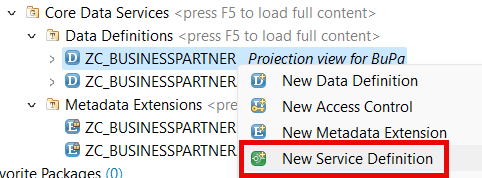
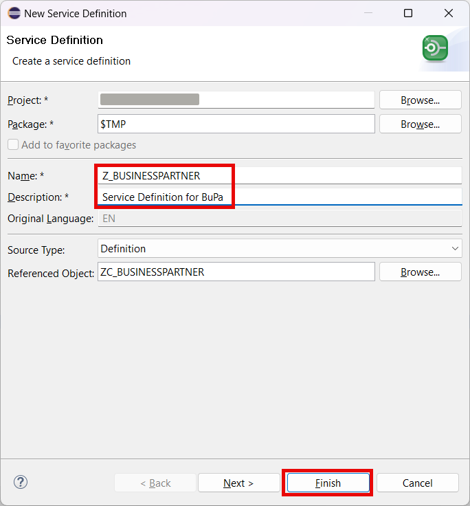
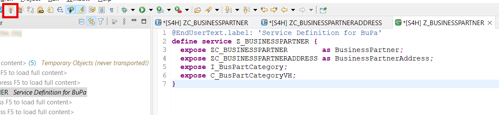
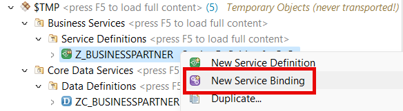
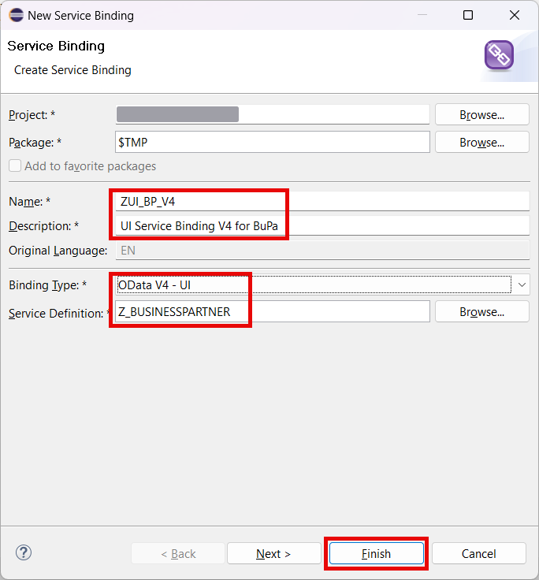
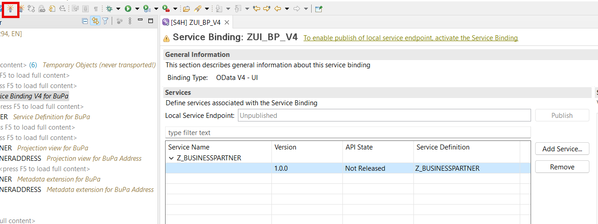
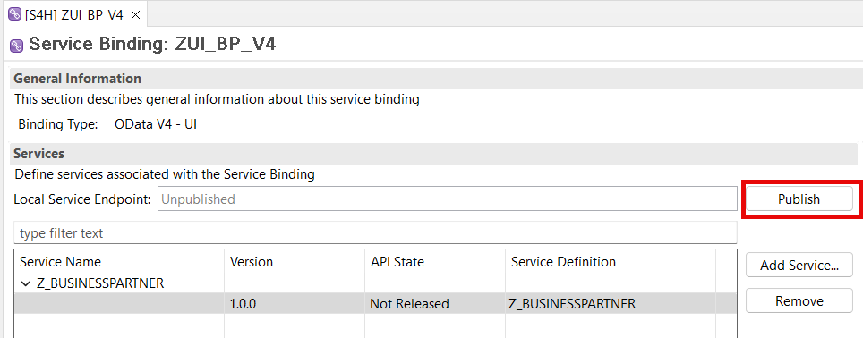

# Expose the OData Service

## Introduction 

In this exercise, you will create objects needed to expose your data model as an UI OData service.

## Task Flow  

In this exercise, you will perform the following tasks:

1. Create service definition
2. Create service binding

## Content

### Task 1: Create service definition

1. Right click on the root projection view **ZC_BUSINESSPARTNER**.

2. Select **New Service Definition** in the popup menu.

   

3. Enter the following details and choose **Finish**:
  - **Z_BUSINESSPARTNER** in the **Name** field
  - **Service Definition for BuPa** in the **Description** field

  

4. Assign aliases to your Business Object projection entities and expose additional associations as shown in the code below:

~~~abap
@EndUserText.label: 'Service Definition for BuPa'
define service Z_BUSINESSPARTNER {
  expose ZC_BUSINESSPARTNER        as BusinessPartner;
  expose ZC_BUSINESSPARTNERADDRESS as BusinessPartnerAddress;
  expose I_BusPartCategory;
  expose C_BusPartCategoryVH;
}
~~~

5. Select **Activate** button.

   

### Task 2: Create service binding

1. Right click on your service definition.

2. Select **New Service Binding** option in the popup menu.

   

3. Enter the following details and then choose **Finish** button:
  - **ZUI_BP_V4** in the **Name** field
  - **UI Service Binding V4 for BuPa** in the **Description** field
  - **OData V4 - UI** in the **Binding Type** list box
  - **Z_BUSINESSPARTNER** in the **Service Definition** field

   

4. Choose **Activate** button.

  

5. After the service binding was activated, choose **Publish** button.  

> It may take several minutes. Please be patient.

  

## Result

You have created a service definition and a service binding. Now your service is ready to be consumed. 

## Further reading / Reference Links

- [Service Definition](https://help.sap.com/docs/ABAP_PLATFORM_NEW/fc4c71aa50014fd1b43721701471913d/b09e4d53bfca4544a9f8910bcc2cd9d6.html)
- [Service Binding](https://help.sap.com/docs/ABAP_PLATFORM_NEW/fc4c71aa50014fd1b43721701471913d/b58a3c27df4e406f9335d4b346f6be04.html)
