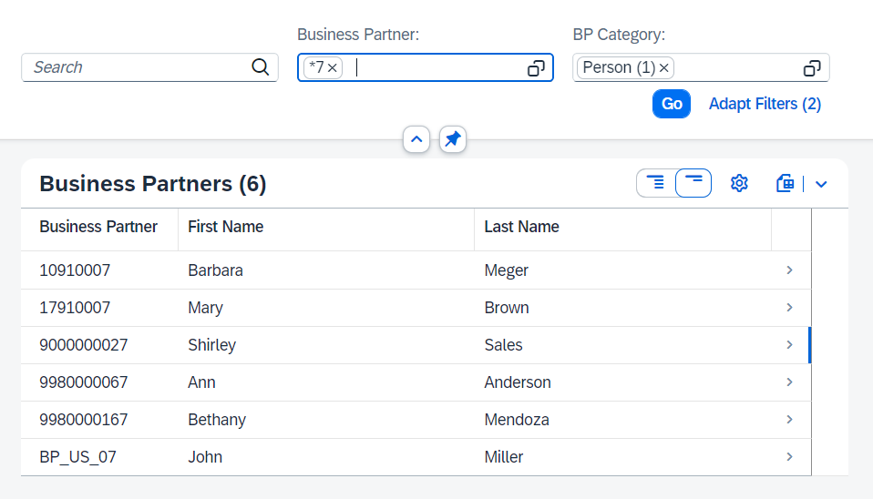
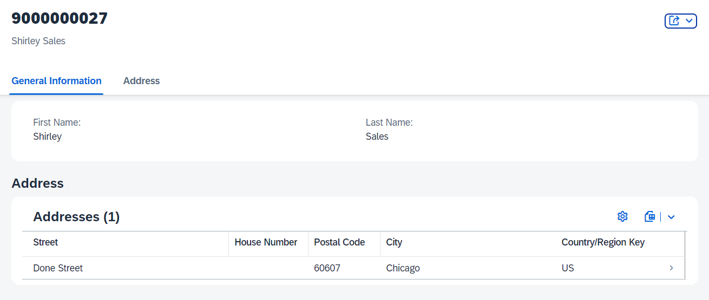

# Test the Service

## Introduction 

In this exercise, you will test the service.

## Content

1. Open your service binding **ZUI_BP_V4**.

2. Go back to the service binding. Choose **Preview** button.

  

3. A new browser window will be opened. Enter your credentials when promted.

4. You should see a first screen with the business partners list. You can choose **Go** button to get all the partners or filter them with 3 fields in the search bar:

  

5. If you select some business partner you will see the addresses table on the next screen:

  

## Result

You have tested your service and verified that UI annotations generate the nice and responsive UI. 
