# Set Up the SAP S/4HANA System

In this section, you will learn how to activate an OData API service in a SAP S/4HANA system, create a user and assign the necessary roles and authorization objects.

You need to be an SAP S/4HANA administrator to be able to follow the steps. 

***Hint:** The following screenshots are done with SAP GUI 7.50 - by using SAP GUI 7.60 the usage could differ, for example tick button instead of a continue button and so on.*

## Activate the OData Service
1. Log in to the SAP S/4HANA system using SAP GUI with your adminstrator user.
2. Call the /n/IWFND/MAINT\_SERVICE transaction.
3. Choose **Add Service**.

   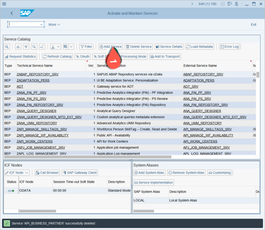
   
4. In the **Add Selected Serviced** screen, enter the following values:
   1. System Alias = LOCAL
   2. Technical Service Name = API\_BU*
   3. Press **Enter** - you should see the API\_BUSINESS\_PARTNER in the list.
   
   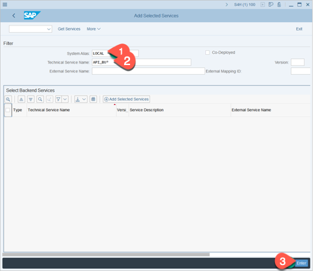

5. Select the **API\_BUSINESS\_PARTNER** checkbox and choose **Add Selected Service**.
 
   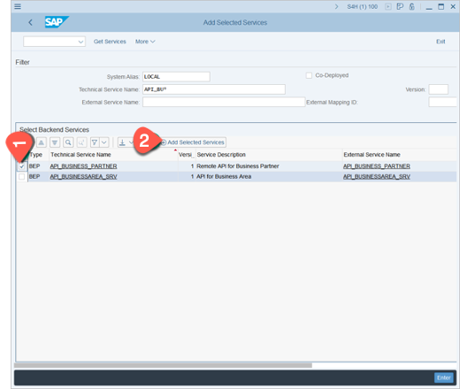

6. The **Add Service** screen appears.
   1. Specify **Package Assignment**, for example $TMP by clicking Local Object.
   2. Select the **Enable OAuth for Service** checkbox.
   3. Choose **Continue** to activate the changes.
   4. Choose **Continue** to confirm the message box.
   
   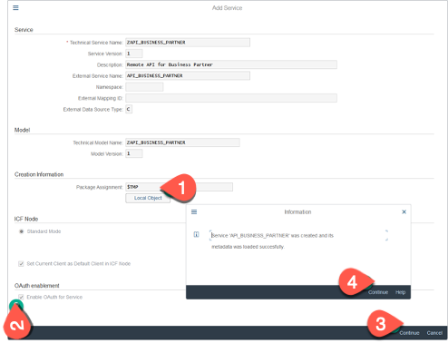

**Result:** The API\_BUSINESS\_PARTNER is now activated and you can leave the transaction.

## Create User and assign Roles and Authorization Objects

### **A: Create a User**
In this section we will create a new user in the SAP S/4HANA system and assign the SAP\_BR\_BUPA\_MASTER\_SPECIALIST role to it.  

1. Call the SU01 transaction:
   1. Enter a user ID.
   2. Choose **Create**.

    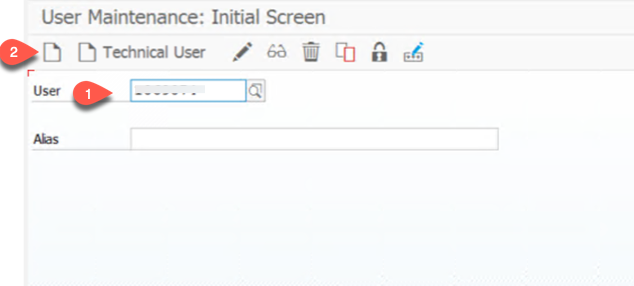
 
2.  Follow these steps:
    1.  Choose the **Address** tab.
    2.  Specify the **Last name** field.
    3.  Enter a valid e-mail address. 
        
        ***Important:** this email is the principal for the SSO communication that we will configure in a later section.*
        
    4. Choose the **Logon Data** tab.

    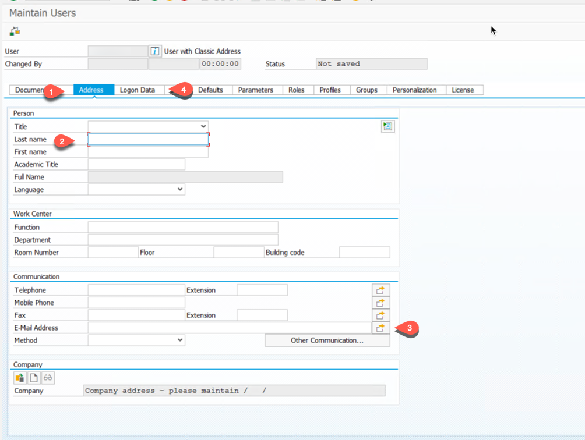

3. In the **Logon Data** tab:
    1. From the **User Type** dropdown menu, select **System**.
    2. Set a password.
    3. Repeat the password.
    4. Choose the **Roles** tab.     
    
    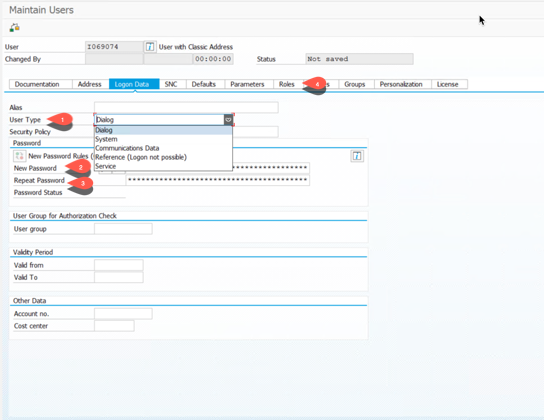
    
4. In the **Roles** tab, select the first empty row in the **Roles** list and choose **Add Roles**.
   
   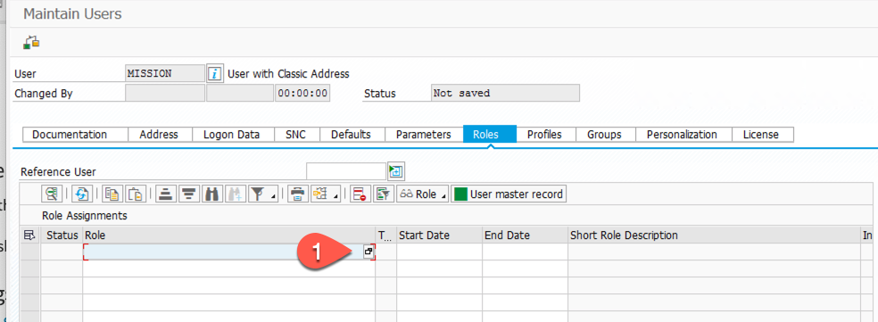

5. Find a role.

   1. In the **Single Role** field, enter **SAP\_BR\_BUPA\***.
   2. Press Enter.
   
    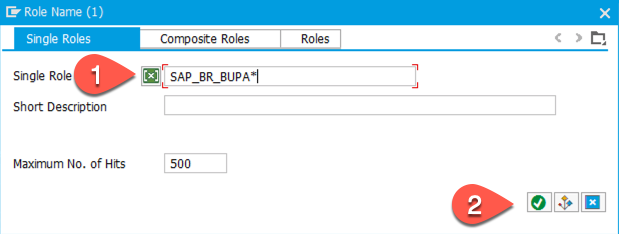

6. Select a role.

   1. Select the **SAP\_BR\_BUPA\_MASTER Specialist** role.
   2. Choose enter/copy.
   
       ***Hint:** This role is necessary to get access to the Business Partner data and the Business Partner Fiori application*
   
   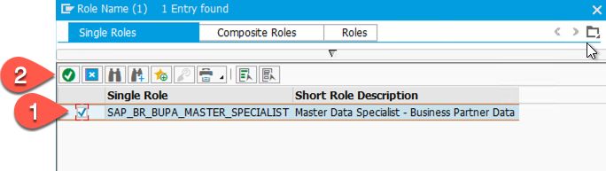

7. Choose **Save**.
   
   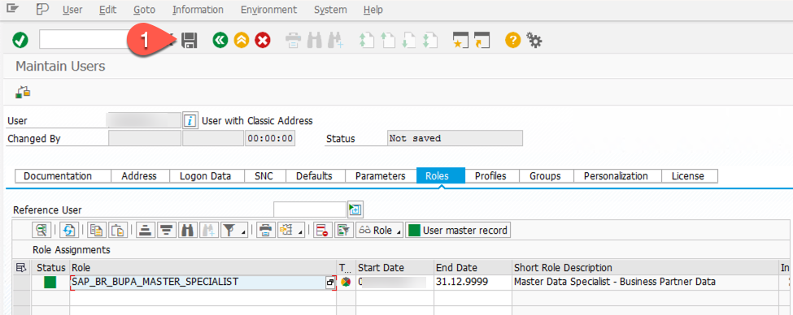 

###  **B: Create an Authorization Object for the OData service**
In this section, we generate a custom authorization object which is necessary to give the user access to the Gateway and to the Business Partner OData service.

1. Call the PFCG transaction:
   1. In the **Role** field, enter a new role name.
   2. Choose **Single Role**.

   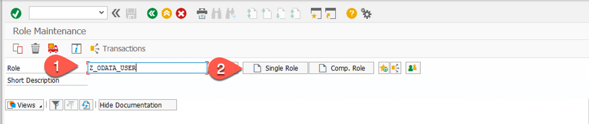 

2. Set the authorizations:
   1. Choose **Save**.
   2. Select the **Authorization** tab.
   3. Choose the **Change Authorization Data** icon.
   
   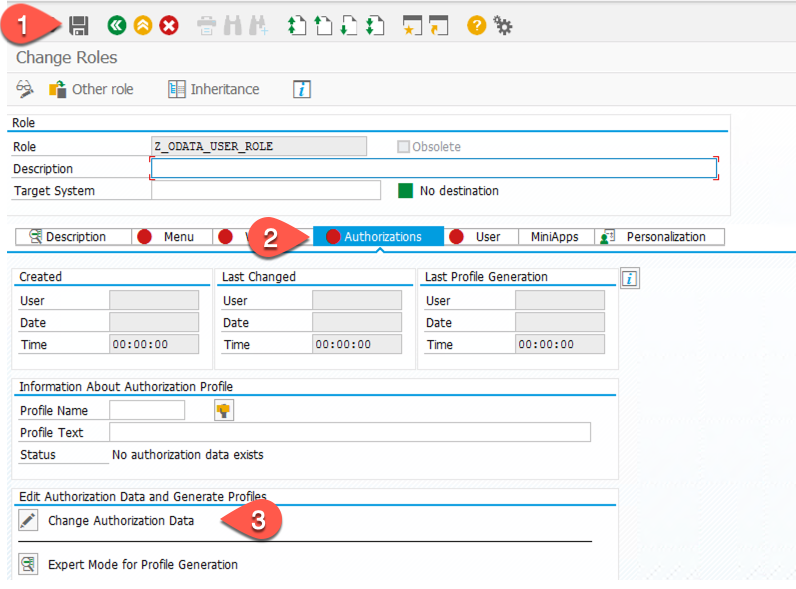

3.  Choose a template:

    1.  Select the **Template for Gateway users (/IWFND/RT\_GW\_USER)**.
    2.  Choose **Apply Template** and then choose **Save**.

    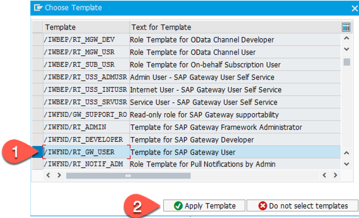

4. Choose **Status** and then **Execute** to assign the authorization.

    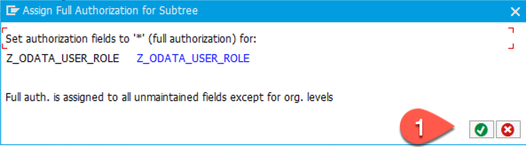

5. Choose **Generate** (Shift+F5). 
   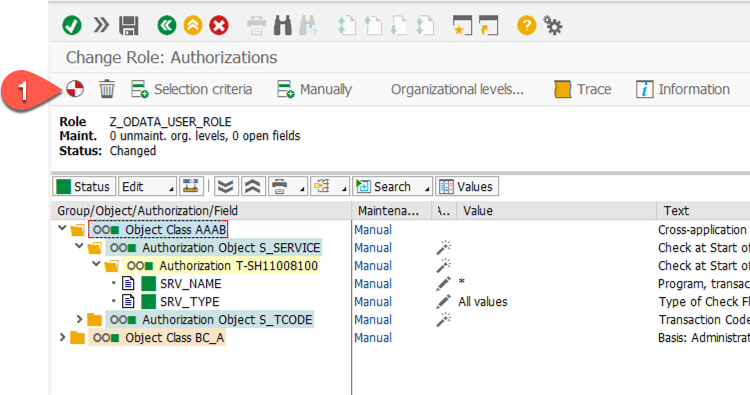

6. In the **Menu** tab, choose **Transaction** > **Authorization Default**.
   
   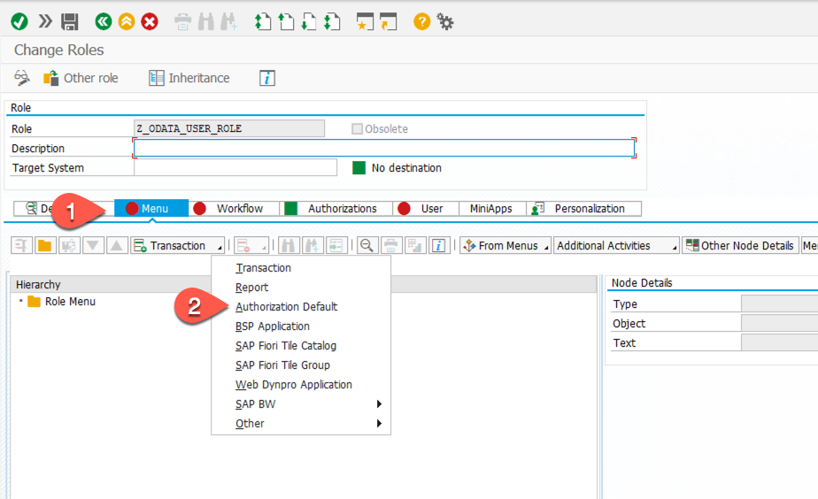

7. Set the service:
   1. In the **Authorization Default** field, select **TADIR Service**. For SAP S/4HANA version 2020, select **IWSG SAP Gateway: Service Groups Metadata** and skip step 2.
   2. In the **Object Type** field, select **IWSG SAP Gateway: Service Groups Metadata**.
   3. Open the Object list.

   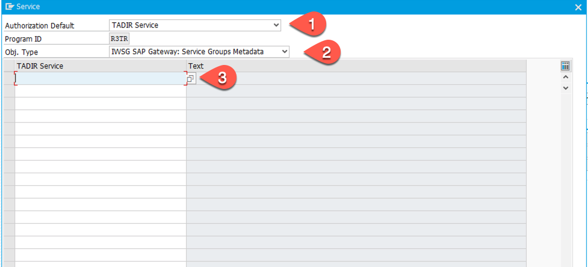

8. Object list:

   1. Select the **ZAPI\_BUSINESS\_PARTNER\_0001** object.
   2. Choose **Confirm**.

   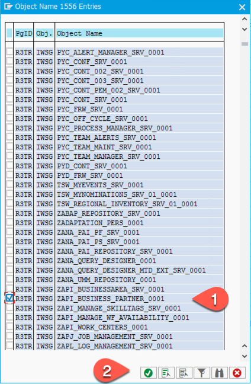

9.  Copy the **TADIR** service to the menu and choose **Save**.
      
      

10. Set up the user:
    1.  Save the Authorization Object
    2.  Select the User tabulator
    3.  Enter or select the user ID you have created in section A
    4.  Choose **User Comparision**
   
    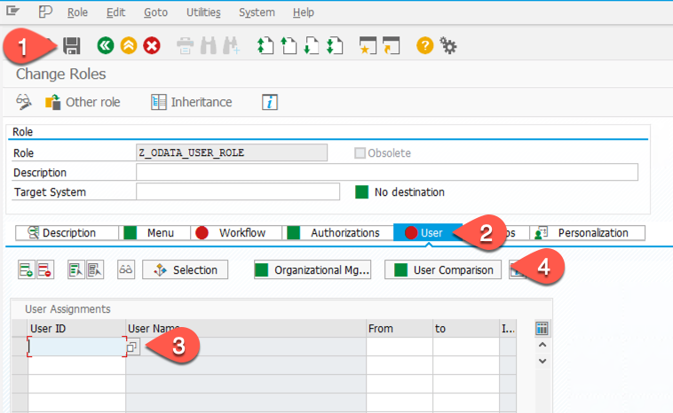
  
11. Complete Comparion
    
    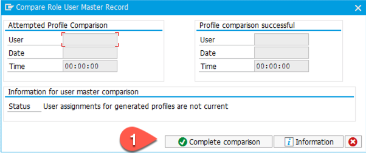

12. Choose Save and you have finished the setup of the user profile     

***Hint:** If the Authentication tabulator turns to red, select this tabulator and select again **Change Authorization Data** - click again on Generate (Shift+F5) - Choose **Save***

### Test the API\_BUSINESS\_PARTNER\_SRV

To see if the setup was done correctly call the Business Partner API with the new user. 

* Call Transaction /N/IWFND/MAINT\_SERVICE
    1. Double-click on ZAPI\_BUSINESS\_PARTNER
    2. Choose **Call Browser**

   
    
    
    Hint: If you use a CAL system, kindly check and use the relevant IP address instead of the default system host name as the host name has to be resolvable by the browser.

* Enter the credentials of the user we have created. You should then see the structure of the BusinessPartner OData service.

    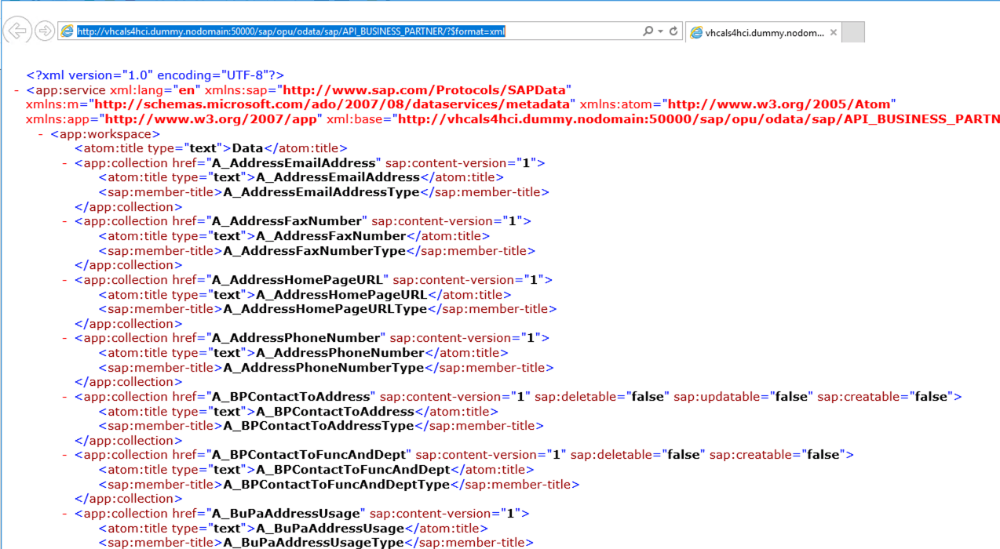

*  Change the end ot the URL to ..../sap/API\_BUSINESS\_PARTNER/A\_BusinessPartner/?$format=xml. You should now see a list of Business Partners.

This completes this mission section.

## Summary

You have activated an API in the S/4 on-premise system and created a user with the necessary roles for CRUD operations of Business Partner data and to access the API\_BUSINESS\_PARTNER\_SRV OData service.

***Hint:** the simplest way for adding additional users with the same roles is just to copy this user profile in the SU01 transaction*

[see also SAP Help: Activate and Maintain Services](https://help.sap.com/viewer/68bf513362174d54b58cddec28794093/202009.002/en-US/bb2bfe50645c741ae10000000a423f68.html)
