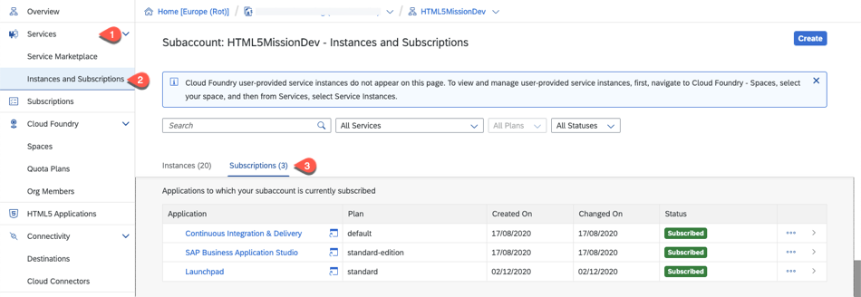

# Setup of a SAP Cloud Platform Account using Boosters
## Introduction

For running the HTML5 mission you will need the following services in your SAP Cloud Platform account.

* SAP Business Application Studio
* SAP Cloud Portal 
* SAP HTML5 Application (kernel service - no quota necessary)
* SAP Continuous Integration & Delivery Service (optional)

The entitlement differs for the pricing option of your account:

**Consumption-based SAP Cloud Platform Account:** 
No entitlement necessary. Be sure that you have enough credits to run the services.

**Subscription-based SAP Cloud Platform Account:** 
You have to create entitlements for the services above - [see also Entitlements and Quotas](https://help.sap.com/viewer/df50977d8bfa4c9a8a063ddb37113c43/Cloud/en-US/38ecf59cdda64150a102cfaa62d5faab.html#loio363f0f68f9704830ac65c87a2562559b).

[Check the costs with the SAP Cloud Platform Estimator Tool](https://www.sap.com/products/cloud-platform/pricing/estimator-tool.html)

**Booster:**

The setup could be done for each service individually. To simplify the setup process, SAP has introduced Boosters. Boosters are a collection of wizards that provides functionalities for specific scenarios to automate and speed-up the installation and configuration process of a SAP Cloud Platform sub-account. This also includes the user management with the mapping of the respective administrator and developer roles.

Before running the booster please check for which regions and infrastructures the services are available - [see SAP Cloud Platform Regions and Service Portfolio ](https://help.sap.com/doc/aa1ccd10da6c4337aa737df2ead1855b/Cloud/en-US/3b642f68227b4b1398d2ce1a5351389a.html) - unfortunately the booster is not able to check this in advance, so it will fail when you select a region where a service is not available.

**Persona:** SAP Cloud Platform Administrator

## Step-by-step

### A: Run the Booster

1. Start the Booster
   1. Login to your global SAP Cloud Platform account.
   2. Select Boosters in the SAP Cloud Account menu.
   2. Select the Booster "Prepare an account for HTML5 application development"
   
   

2.  Booster Overview
   
    

3.  Review the Components that will be installed with the Booster - click Start
    
    
 
4.  Check Prerequisites - the Booster checks if you have all the entitlements that are needed to run it. There is only a check for mandatory components. As the "Continous Integration & Delivery service" is optional, the Booster will not check for it. If you want to use it, be sure that you have an Entitlement for this service.
   
    
 
5.  Setup Subaccount and check/assign Entitlements: 
    Here you set the necessary quota for running HTML5 applications on your subaccount.
    For running this mission, below mentioned quota of the services are the minimum requirements, for building additional applications in your subaccount you have to increase the quota accordingly.

    If you do not entitlement for the Continous Integration & Delivery service it will not appear in the list. For accounts with the consumption-based model you can delete it, if you don't want to use it as it is an optional service.
    
    
    

 
   
6.  Setup Subaccount credentials 
    1.  Set Subaccount name
    2.  Select your preferred cloud provider
    3.  Select the region for the subaccount
    4.  Set the subaccount ID - you can keep the default
    5.  Set the subaccount org name - change it to a meaningful name
    6.  Set a space name - that's the space we will use for our mission project. In general it's recommended to have one space per project. You can later add further spaces for additional projects manually. 
    7.  Press next

    

7.  Add Users - in this section we can add additional users as administrators and developers for the subaccount. The user who is using the Booster is added automatically as "Administrator" and also added as a Security Admin.
    1. Select your user origin 
    2. Add administrator
    3. Add developer
    4. Press Next.

    

8.  Review your configuration, if everything is correct press finish 
    
    
 

9.  Watch the progress screen, until it turns green for all setup steps.

    

10. When the Booster has executed successfully you will get a success window. - Click on "Navigate to Subaccount" to enter the newly created subaccount.

    

### B: Check Subaccount
In your new subaccount check the following

1. Members - Select Org Members in the Cloud Foundry submenu. in this list you will see all that all users you have added as administrator have the "Organization Manager" role. Users you have added as developer has no Organization Role.
   
     

2. Security - Open the Security section and select Administrators. Again you should see the adminstrator users assigned with the "User & Role Administrator" role. 

     

3. Security - Select "Role Collection" in the Security section. You can see all the role collections for the different services that are created by the Booster. There are two specific collection called **Extension_UX_Administrator** and **Extension_UX_Developer** . Those are the master collections either for Administrators or Developers and contains all the necessary roles which are needed to access the services to build and deploy a HTML5 extension application. If you want to add additional users later, you have to assign those role collection to them. Click on the role *Extension_UX_Administrator*.
   
     

4. You can check that all necessary roles already assigned for the Administrator users to access *Business Application Studio*, *Portal* and *Continous Integration & Delivery service*. 

     
     
5. Now click on *Extension_UX_Deverloper* in the previous acreen to see the assigned roles for developer. If you have addtional developers later, then add the developers in this screen by clicking the 'Edit' button and selecting the 'Identity Provider'.

     
     
6. Go back to the Overview of your subaccount.

7. Select the "Subscriptions" menu. You should see that the following services have been subscribed
    * SAP Business Application Studio
    * SAP Cloud Portal 
    * Continuous Integration & Delivery Service (optional)

     

8. Click on "Go to Application" to see if you're able to access the subscriptions.

## Summary

This Booster has automated a couple of steps for setting up a SAP Cloud Platform subaccount for building and running HTML5 applications. This includes the following setup steps, which could also be done manually:

* [Setup of SAP Cloud Platform Environment](https://help.sap.com/viewer/368c481cd6954bdfa5d0435479fd4eaf/Cloud/en-US/302b47b11e1749c3aa9478f4123fc216.html)
* [Setup SAP Business Application Studio](https://help.sap.com/viewer/c8f199cdcb7b48f2adc1bb3ec44e4dc4/Trial/en-US/19611ddbe82f4bf2b493283e0ed602e5.html)
* [Setup SAP Cloud Portal](https://help.sap.com/viewer/ad4b9f0b14b0458cad9bd27bf435637d/Cloud/en-US/fd79b232967545569d1ae4d8f691016b.html)
* [Setup SAP Cloud Continous Integration and Delivery](https://help.sap.com/viewer/99c72101f7ee40d0b2deb4df72ba1ad3/Cloud/en-US/719acaf61e4b4bf0a496483155c52570.html)
* [HTML5 Applications](https://help.sap.com/viewer/29badeeee3684338b2e870139bdc4d86/Cloud/en-US/3db887a26f6e44bd929f4ccdb9e7f5d7.html)

