# Setup of a SAP Business Technology Platform subccount using Boosters
## Introduction

**Abbreviation:** SAP Business Technology Platform = SAP BTP

For running the HTML5 mission you will need the following services in your SAP BTP account:

* SAP Business Application Studio
* SAP Launchpad or optional SAP Cloud Portal service  
* SAP HTML5 Application (kernel service - no quota necessary)
* SAP Continuous Integration & Delivery Service (optional)

The entitlement differs for the pricing option of your account:

**Free Tier option with Pay-as-you-go (PAYG) or Cloud Platform Enterprise Agreement (CPEA) account** or **SAP Business Technology Platform Trial**

You need to manually setup the subaccount and assign role collections to users, follow the instructions in [Setup of a SAP Business Technology Platform subccount manually](../freetier/README.md).

**Consumption-based SAP BTP Account:** 
No entitlement necessary. Be sure that you have enough credits to run the services.

**Subscription-based SAP BTP Account:** 
You have to create entitlements for the services above - [see also Entitlements and Quotas](https://help.sap.com/viewer/df50977d8bfa4c9a8a063ddb37113c43/Cloud/en-US/38ecf59cdda64150a102cfaa62d5faab.html#loio363f0f68f9704830ac65c87a2562559b).

[Check the costs with the SAP BTP Estimator Tool](https://www.sap.com/products/cloud-platform/pricing/estimator-tool.html)

**Booster:**

The setup could be done for each service individually. To simplify the setup process, SAP has introduced Boosters. Boosters are a collection of wizards that provides functionalities for specific scenarios to automate and speed-up the installation and configuration process of a SAP BTP subaccount. This also includes the user management with the mapping of the respective administrator and developer roles.

Before running the booster please check for which regions and infrastructures the services are available - [see SAP BTP Regions and Service Portfolio ](https://help.sap.com/doc/aa1ccd10da6c4337aa737df2ead1855b/Cloud/en-US/3b642f68227b4b1398d2ce1a5351389a.html) - unfortunately the booster is not able to check this in advance, so it will fail when you select a region where a service is not available.

**Persona:** Cloud Administrator

## Step-by-step

> The Booster for HTML5 application development is not available for trial accounts, if you're using a SAP BTP trial account please go to [section C for the manual setup](#manualSetup).

### A: Run the Booster

1. Start the Booster
   1. Login to your global SAP BTP account.
   2. Select Boosters in the account menu.
   2. Select the Booster **Prepare an account for HTML5 application development**
   
   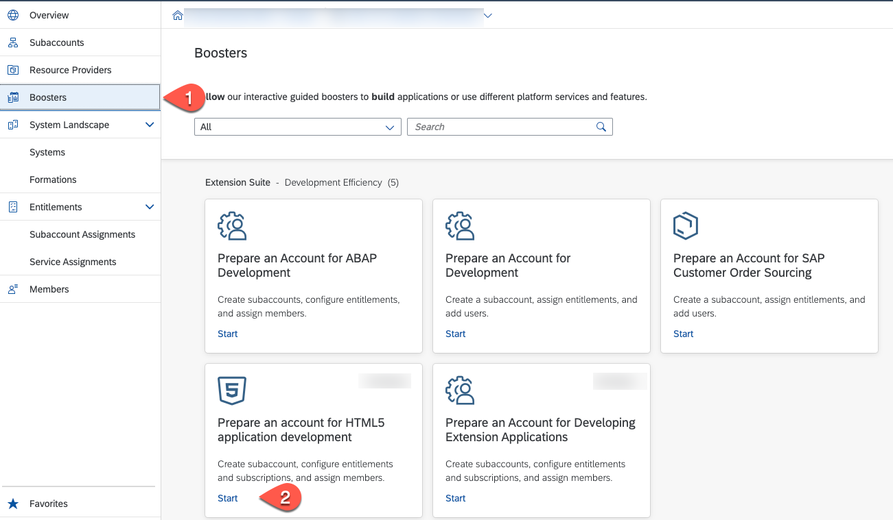

2.  Booster Overview
   
    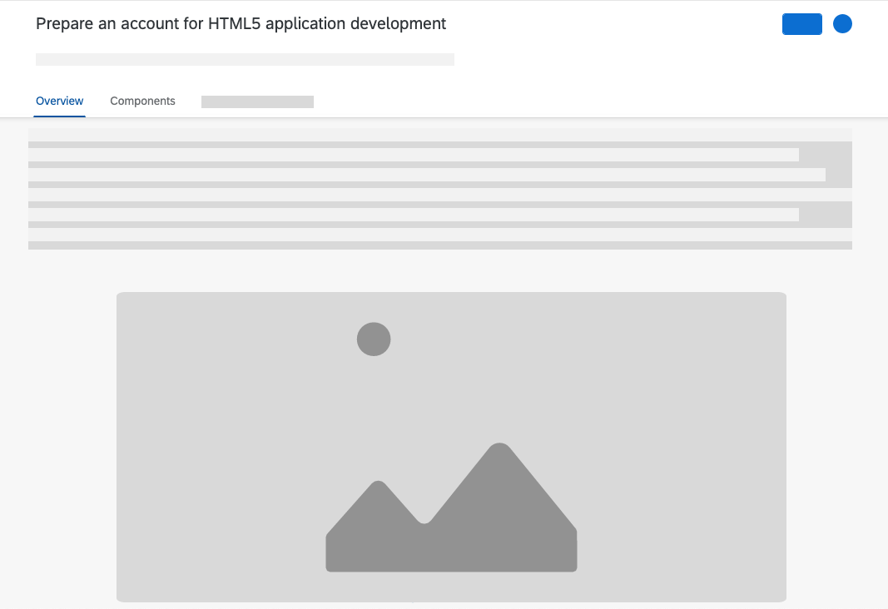

3.  Choose the **Components** tab and review the Components that will be installed with the Booster - choose **Start**
    
    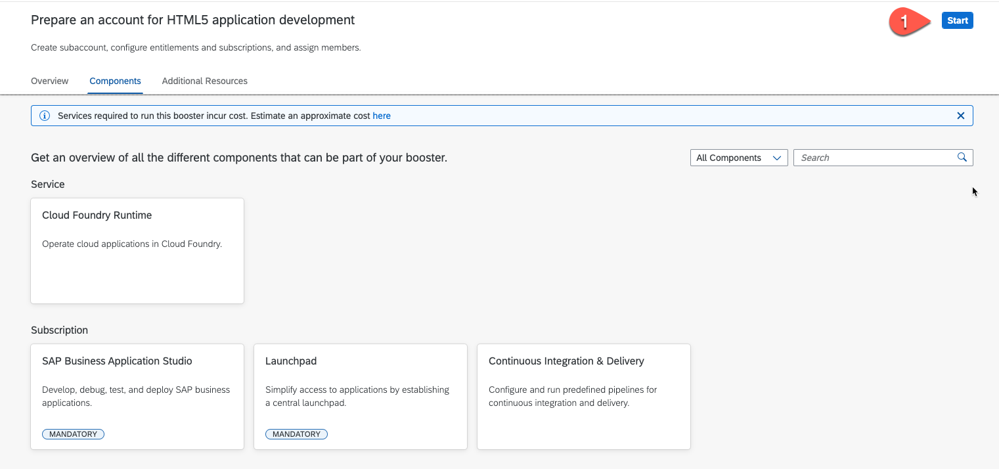
 
4.  Check Prerequisites - the Booster checks if you have all the entitlements that are needed to run it. There is only a check for mandatory components. As the **Continous Integration & Delivery service** is optional, the Booster will not check for it. If you want to use it, be sure that you have an Entitlement for this service.
   
    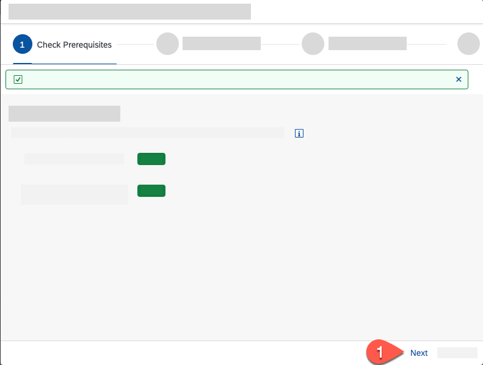
 
5.  Setup Subaccount and check/assign Entitlements: 
    
    If you do not have set an entitlement for the **Continous Integration & Delivery** service it will not appear in the list. For accounts with the consumption-based model you can delete it, if you don't want to use it. It is optional for this mission.
    
    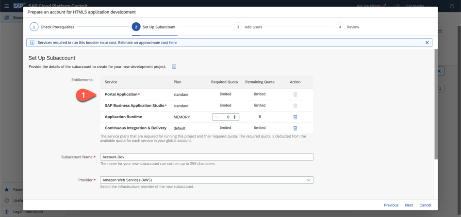
    
    Set the Cloud Foundry Runtime to atleast 1 for Subscription Based Accounts :
    
    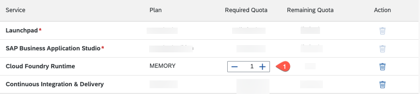
   
6.  Setup Subaccount credentials 
    1.  Set Subaccount name
    2.  Select your preferred cloud provider
    3.  Select the region for the subaccount
    4.  Set the subaccount ID - you can keep the default
    5.  Set the subaccount org name - change it to a meaningful name
    6.  Set a space name - that's the space we will use for our mission project. In general it's recommended to have one space per project. You can later add further spaces for additional projects manually. 
    7.  Press next

    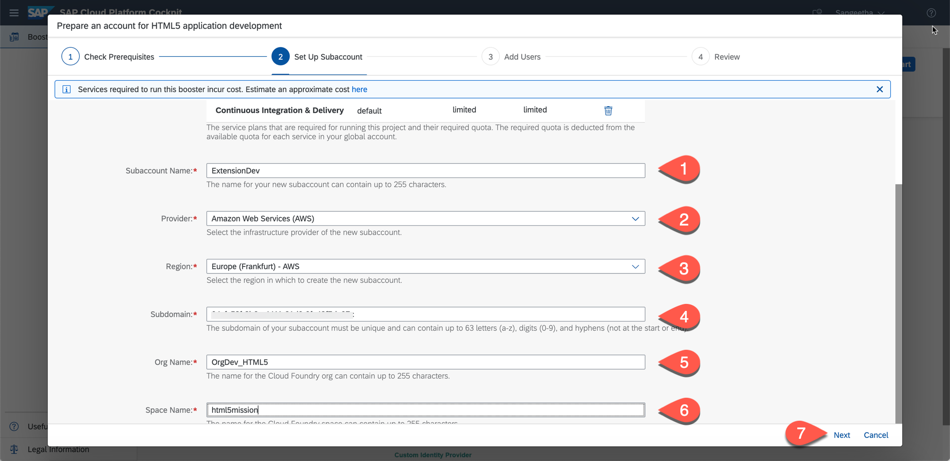

7.  Add Users - in this section we can add additional users as administrators and developers for the subaccount. The user who is using the Booster is added automatically as **Administrator** and also added as a Security Admin. 
    1. Select your user origin - that's your standard Identity & Authentication service  
    2. Add administrators
    3. Add developers
    4. Press Next.

    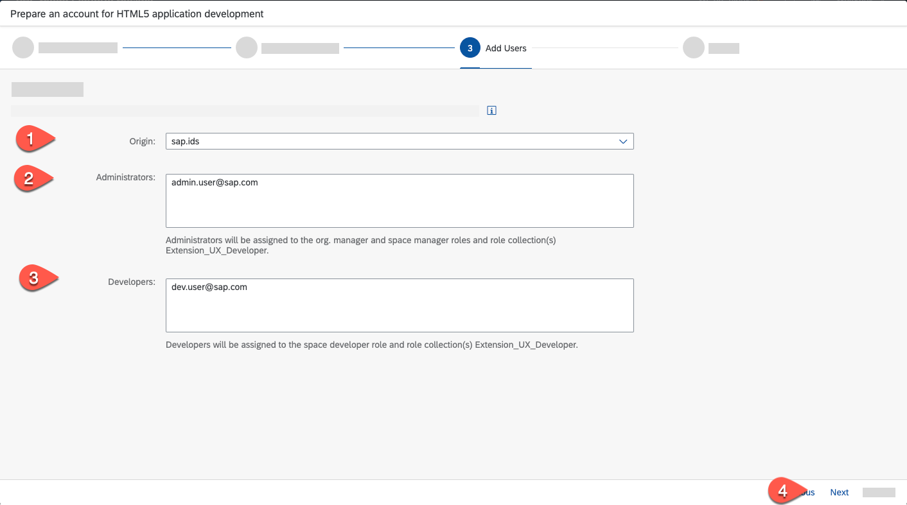

8.  Review your configuration, if everything is correct press finish 
    
    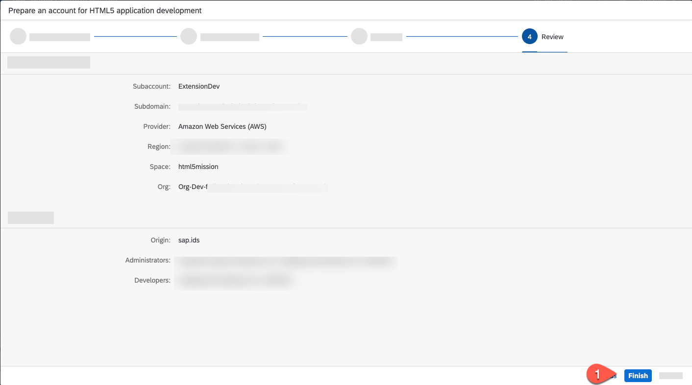
 

9.  Watch the progress screen, until it turns green for all setup steps.

    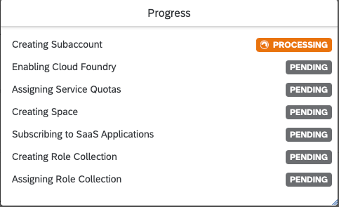

10. When the Booster has executed successfully you will get a success window. Select **Navigate to Subaccount** to enter the newly created subaccount.

    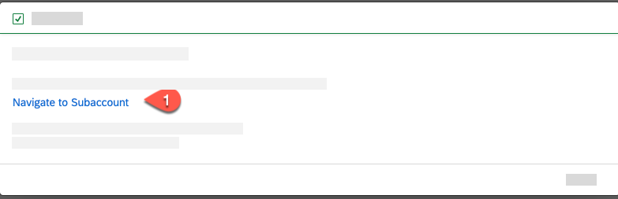

### B: Check Subaccount
In your new subaccount check the following

1. Members - Select Org Members in the Cloud Foundry submenu. in this list you will see all that all users you have added as administrator have the "Organization Manager" role. Users you have added as developer has no Organization Role.
   
     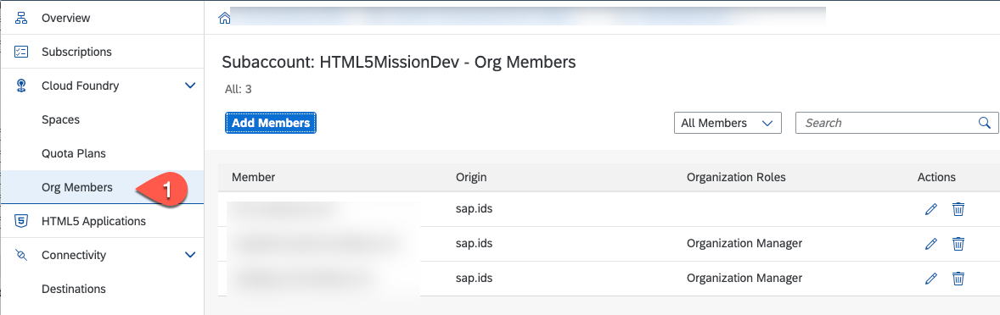

2. Security - Open the Security section and select **Users**. Again you should see all the users who have access to this sub-account. Click on your user and check the role collections assigned to you.  

     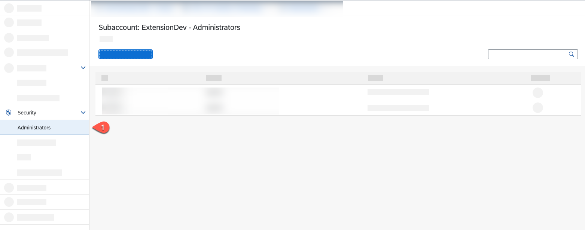

3. Security - Select "Role Collection" in the Security section. You can see all the role collections for the different services that are created by the Booster. There are two specific collection called **Extension_UX_Administrator** and **Extension_UX_Developer** . Those are the master collections either for Administrators or Developers and contains all the necessary roles which are needed to access the services to build and deploy a HTML5 extension application. If you want to add additional users later, you have to assign those role collection to them. Click on the role **Extension_UX_Administrator**: 
   
     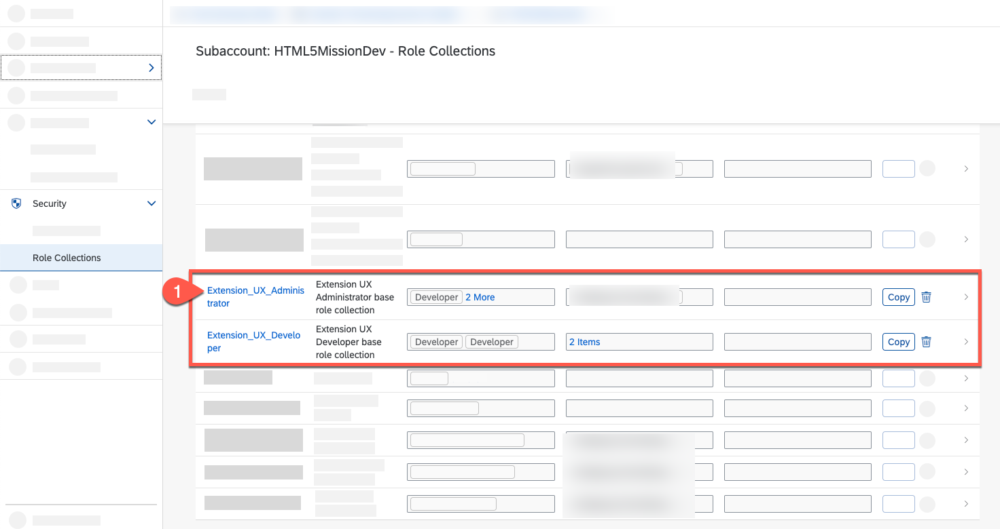

4. You can check that all necessary roles already assigned for the Administrator users to access **Business Application Studio**, **Launchpad** and **Continous Integration & Delivery service**. By pressing the **Edit** button you can add additional roles and user to to this role collection. 

     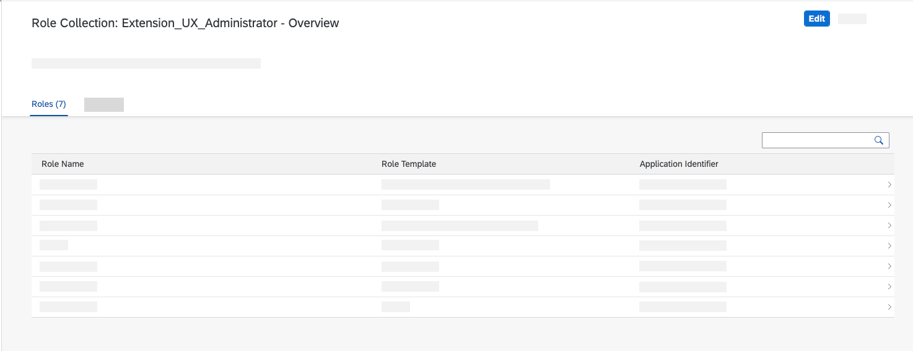
     
5. Now select the *Extension_UX_Deverloper* in the previous acreen to see the assigned roles for a developer. If you have addtional developers later, then add the developers in this screen by choosing the **Edit** button and selecting the **Identity Provider**.

     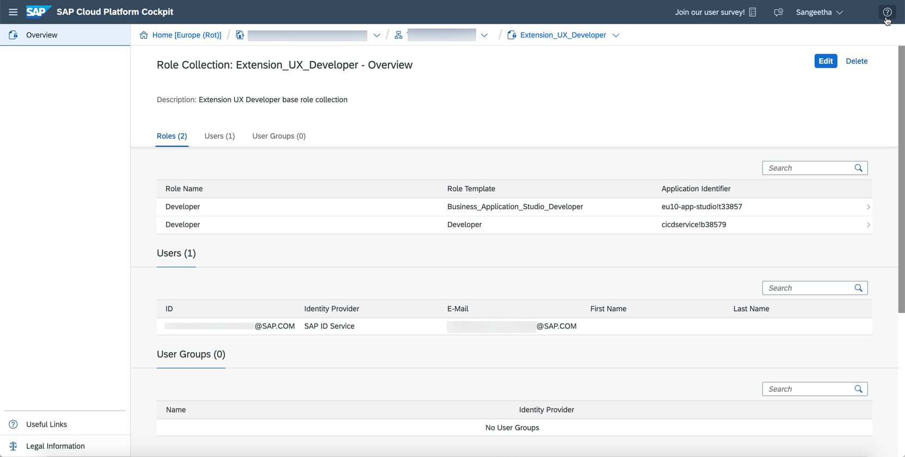
     
6. Go back to the Overview of your BTP subaccount.

7. Click **Services** and then choose **Instances and Subscriptions**. Select the tab **Subscriptions**, You should see that the following services have been subscribed:

    * SAP Business Application Studio
    * Launchpad
    * Continuous Integration & Delivery Service (optional)
  
   Click on "Go to Application" to see if you're able to access the subscriptions.

     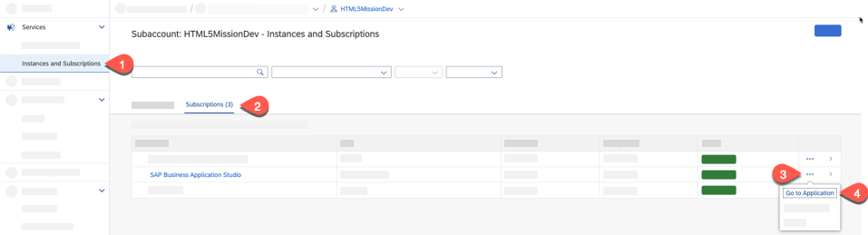

